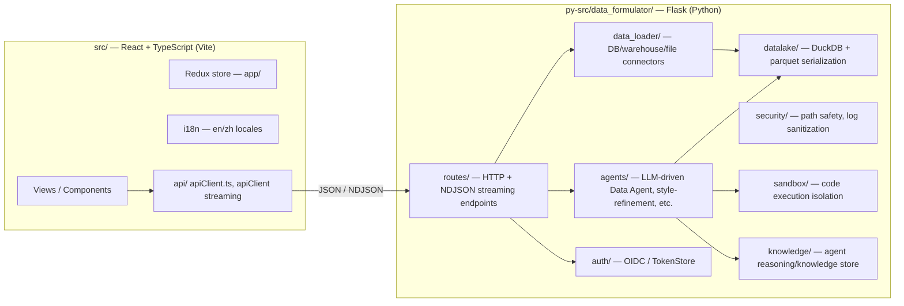

# Data Formulator: Project Overview & Cursor → Copilot Porting Guide

This document does two things:

1. **Describes the project** — architecture, major subsystems, and where the development conventions live.
2. **Explains how to port the existing Cursor rules/skills (`.cursor/`) to GitHub Copilot's native mechanisms in VS Code (`.github/`)**, so Copilot-only contributors get the same guardrails Cursor contributors already have.

**Status: ported (2026-07-09).** All 14 instruction files and 3 skill folders below now exist under `.github/instructions/` and `.github/skills/`. One deviation from the original plan: `df-package-manager-conventions.instructions.md` was scoped to `package.json,yarn.lock` (pattern-applied) rather than `**` (always-on) — see the note in §3, row 11. `.cursor/` was left untouched.

---

## 1. Project Overview

**Data Formulator** ([microsoft/data-formulator](https://github.com/microsoft/data-formulator)) is a Microsoft Research tool for AI-assisted data visualization: connect data (files, databases, warehouses, screenshots), explore it with a conversational Data Agent, and produce editable, shareable charts/reports.

### 1.1 High-level architecture



- **Backend** (`py-src/data_formulator/`): Flask app (`app.py`) exposing JSON and NDJSON-streaming routes. `agents/` holds the LLM agents (data exploration, recommendation, style refinement, data loading, report generation). `data_loader/` + `data_connector.py` implement pluggable connectors (Superset, Kusto, Cosmos DB, MySQL, PostgreSQL, MSSQL, BigQuery, S3, Azure Blob, local files). `datalake/` centralizes DuckDB usage and DataFrame⇄JSON serialization (`parquet_utils.py`). `security/` holds `ConfinedDir` path-jailing and log sanitization. `errors.py` / `error_handler.py` implement the unified error protocol used by every route.
- **Frontend** (`src/`): React + TypeScript, Redux (`app/`), Vite bundler, i18n (English + Chinese) via `react-i18next`, a semantic chart engine, and the Data Thread UI.
- **Tests** (`tests/`): `tests/backend/` (pytest, marked with `pytestmark = [pytest.mark.backend]`), `tests/frontend/` (Vitest, mirrors `src/` structure), plus `database-dockers/` for integration tests against real DB engines.
- **Docs** (`docs/dev-guides/`): the canonical, numbered developer guides (streaming protocol, log sanitization, data loader development, auth, i18n, error handling, path safety, catalog sync, sandbox sessions, row limits, model capability degradation, DataFrame serialization). These are the **source of truth**; both the Cursor rules and this porting guide summarize them.
- **`agency/`**: unrelated Azure Agency/MCP tooling config for this repo's own AI-assistant operations (not a data-formulator runtime component).

### 1.2 Two parallel AI-assistant configuration layers

This repository currently has **two independent AI-agent configuration systems** living side by side:

| Folder | What it is | Scope |
| --- | --- | --- |
| `.cursor/rules/*.mdc` + `.cursor/skills/*/SKILL.md` | **Project-specific dev conventions** for Data Formulator (testing, error handling, i18n, path safety, logging, package manager, review cadence) | Data Formulator codebase |
| `.github/copilot-instructions.md`, `.github/instructions/`, `.github/skills/`, `.github/prompts/`, `.github/agents/` | The **"Alex — ACT Edition"** heir brain — a general-purpose critical-thinking/metacognition framework for the AI assistant itself (unrelated to Data Formulator's domain conventions) | The assistant's own reasoning discipline, applies to any repo it's deployed into |

**This matters for the port**: the `.github/instructions/` and `.github/skills/` directories are not empty or Data-Formulator-specific today — they're populated by a different system (ACT Edition). Porting Cursor's project rules into the same directories is safe and additive (Copilot loads every matching `*.instructions.md` file, there's no single-file limit), but new files should be clearly named so nobody confuses "Alex ACT Edition cognitive framework" with "Data Formulator coding conventions." This guide uses a `df-` filename prefix for that reason (see §3).

---

## 2. How Cursor Rules/Skills Map to Copilot

| Cursor concept | Trigger model | Copilot/VS Code equivalent | Trigger model |
| --- | --- | --- | --- |
| `.cursor/rules/*.mdc` with `alwaysApply: true` | Injected into every request | `.github/instructions/*.instructions.md` with `applyTo: "**"` | Injected into every request |
| `.cursor/rules/*.mdc` with `alwaysApply: false` + `globs: <pattern>` | Auto-attached when a matching file is open/edited | `.github/instructions/*.instructions.md` with `applyTo: <glob>` | Auto-attached when a matching file is referenced |
| `.cursor/rules/*.mdc` with a `description` and no globs ("Agent Requested") | Model decides to pull it in based on the description | `.github/skills/<name>/SKILL.md` | Model decides to invoke it based on the `description`, surfaced in the chat skill picker |
| `.cursor/skills/<name>/SKILL.md` | Model-invoked, same `agentskills.io` spec | `.github/skills/<name>/SKILL.md` | **Identical spec** — VS Code Copilot and Cursor both implement the same `SKILL.md` format (YAML frontmatter: `name`, `description`, optional `license`/`compatibility`/`allowed-tools`, then Markdown body) |
| Manual rules (`@ruleName` mention, no globs/description) | User must explicitly reference | `.github/prompts/*.prompt.md` (slash command) | User explicitly invokes via `/name` |

Key implications:

- **Skills port with zero content changes.** Cursor's `.cursor/skills/*/SKILL.md` and Copilot's `.github/skills/*/SKILL.md` are the same specification. This is a directory copy, not a rewrite.
- **Rules require a frontmatter translation** (`alwaysApply`/`globs` → `applyTo`), because Copilot has a single unified gate (`applyTo`) instead of Cursor's three-way always/auto/agent-requested split. An "Agent Requested" rule (description-only, no glob) has no direct `applyTo` equivalent — it should become a Skill instead, since Copilot skills are exactly "the model decides to load this based on its description."
- **`applyTo` accepts comma-separated glob lists** (confirmed already in use in this repo's own `.github/instructions/*.instructions.md` files, e.g. `applyTo: "**/*tool*,**/*mcp*,**/*github*"`), so multi-glob Cursor rules (`unified-error-protocol.mdc`: `py-src/**/*.py,src/**/*.{ts,tsx}`) port directly without restructuring.
- **Brace-expansion globs** (`{routes,agents,data_loader,datalake,security,knowledge}` in `path-safety.mdc`) are not confirmed to be supported by VS Code's `applyTo` matcher. Verify after porting (see §5); if unsupported, expand to an explicit comma-separated list of full paths.

---

## 3. File-by-File Port Plan: Rules → Instructions

All 14 files in `.cursor/rules/` were read and are mapped below. Frontmatter anomalies found in the source files are flagged with ⚠ — fix these during the port rather than propagating them.

| # | Source (`.cursor/rules/`) | Source frontmatter | Target (`.github/instructions/`) | `applyTo` | Notes |
| --- | --- | --- | --- | --- | --- |
| 1 | `backend-test-conventions.mdc` | `alwaysApply: false`, `globs: tests/backend/**/*.py` | `df-backend-test-conventions.instructions.md` | `tests/backend/**/*.py` | Direct port |
| 2 | `dataframe-serialization.mdc` | **⚠ no frontmatter at all** | `df-dataframe-serialization.instructions.md` | `py-src/data_formulator/**/*.py` | Source file has no YAML header, so in Cursor it likely isn't auto-attached at all today (effectively dead/manual-only). Add explicit scoping on port — recommend backend-wide since serialization helpers are called from agents, routes, and datalake alike |
| 3 | `dev-guides-first.mdc` | `alwaysApply: true`, `globs:` (empty) | `df-dev-guides-first.instructions.md` | `**` | Direct port, always-on |
| 4 | `error-response-safety.mdc` | `alwaysApply: false`, `globs: py-src/**/*.py` | `df-error-response-safety.instructions.md` | `py-src/**/*.py` | Direct port |
| 5 | `frontend-test-conventions.mdc` | `alwaysApply: false`, `globs: tests/frontend/**/*.test.{ts,tsx}` | `df-frontend-test-conventions.instructions.md` | `tests/frontend/**/*.test.{ts,tsx}` | Direct port |
| 6 | `i18n-no-hardcoded-strings.mdc` | **⚠ `alwaysApply: true` + `globs: src/**/*.{ts,tsx}`** (contradictory combo — Cursor's "always" mode ignores globs) | `df-i18n-no-hardcoded-strings.instructions.md` | `src/**/*.{ts,tsx}` | Port using the glob, not `**` — an unscoped always-on port would inject frontend i18n guidance into backend Python requests, which is wrong |
| 7 | `implementation-review-checklist.mdc` | `alwaysApply: true`, `globs:` (empty) | `df-implementation-review-checklist.instructions.md` | `**` | Direct port, always-on |
| 8 | `incremental-development-cadence.mdc` | `alwaysApply: true`, `globs:` (empty) | `df-incremental-development-cadence.instructions.md` | `**` | Direct port, always-on |
| 9 | `language-injection-conventions.mdc` | `alwaysApply: false`, `globs: py-src/data_formulator/agents/**/*.py,py-src/data_formulator/routes/agents.py` | `df-language-injection-conventions.instructions.md` | same | Direct port, multi-glob |
| 10 | `log-sanitization.mdc` | `alwaysApply: false`, `globs: py-src/**/*.py` | `df-log-sanitization.instructions.md` | `py-src/**/*.py` | Direct port |
| 11 | `package-manager-conventions.mdc` | **⚠ `alwaysApply: true` + `globs: package.json, yarn.lock`** (same contradictory combo as #6) | `df-package-manager-conventions.instructions.md` | `package.json,yarn.lock` | **Revised during the post-port review**: shipped scoped (pattern-applied), not `**`. With 4 other df- files already always-on plus ~13 pre-existing ACT always-on files, adding a 5th always-on file for a one-paragraph rule wasn't worth the shared token budget — see §6 |
| 12 | `path-safety.mdc` | `alwaysApply: false`, `globs: py-src/data_formulator/{routes,agents,data_loader,datalake,security,knowledge}/**/*.py` | `df-path-safety.instructions.md` | Expanded to an explicit comma-separated list (brace-expansion support wasn't verified at port time — see §2) | Content is in Chinese (bilingual repo convention); keep as-is, Copilot handles non-English instructions fine |
| 13 | `test-driven-workflow.mdc` | `alwaysApply: true`, `globs:` (empty) | `df-test-driven-workflow.instructions.md` | `**` | Direct port, always-on. Content is in Chinese |
| 14 | `unified-error-protocol.mdc` | `alwaysApply: false`, `globs: py-src/**/*.py,src/**/*.{ts,tsx}` | `df-unified-error-protocol.instructions.md` | `py-src/**/*.py,src/**/*.{ts,tsx}` | Direct port, multi-glob covering both stacks |

### Frontmatter translation template

```markdown
---
description: "<same one-line description as the .mdc file>"
applyTo: "<converted glob(s), or ** for always-on>"
---

<body copied verbatim from the .mdc file, minus the old --- frontmatter block>
```

(This repo's existing ACT instructions also carry a `lastReviewed: YYYY-MM-DD` field — optional, but recommended for consistency with the rest of `.github/instructions/`.)

---

## 4. File-by-File Port Plan: Skills

All 3 skills in `.cursor/skills/` are **direct copies** — same spec, no translation needed:

| Source | Target |
| --- | --- |
| `.cursor/skills/error-handling/SKILL.md` | `.github/skills/error-handling/SKILL.md` |
| `.cursor/skills/language-injection/SKILL.md` | `.github/skills/language-injection/SKILL.md` |
| `.cursor/skills/path-safety/SKILL.md` | `.github/skills/path-safety/SKILL.md` |

No name collisions exist with the current ACT Edition skill set (`agent-creator`, `code-review`, `critical-thinking`, etc.), so these three copy over cleanly.

---

## 5. Step-by-Step Execution Plan (completed)

1. ✅ **Created `.github/instructions/` entries** (14 files, table in §3) — bodies condensed from each `.mdc`, frontmatter translated, and each file brought up to this brain's own `instruction-review` bar (minimal frontmatter, anti-pattern table, `## Would Revise If` falsifier, line budget).
2. ✅ **Copied the 3 skill folders** verbatim into `.github/skills/` (`error-handling/`, `language-injection/`, `path-safety/`) — no name collisions with the existing ACT skill set.
3. ⚠️ **Brace-glob support not verified interactively.** `df-path-safety.instructions.md` ships with the expanded comma-separated form rather than the brace-group shorthand — safer default, revisit if VS Code's matcher is later confirmed to support `{a,b,c}` groups.
4. ✅ **Always-on budget checked** — see §6 for the full accounting; one file (`package-manager-conventions`) was rescoped from always-on to pattern-applied as a result.
5. ✅ **`.cursor/` left untouched.** Cursor users keep working exactly as before; the port is additive, not a migration that removes the original.
6. **Still open — source-of-truth policy**: decide whether `docs/dev-guides/` stays canonical with both `.cursor/rules/` and `.github/instructions/df-*` as thin mirrors (true today), or whether the two are allowed to drift and must be updated together by hand. Not decided by this port — flag for the team.
7. **Still open — optional**: `.github/copilot-instructions.local.md` still ships as an empty heir-owned template (`## Project Context`, `## My Preferences` placeholders only) — a natural place for a one-paragraph Data Formulator summary, not filled in as part of this port since it wasn't requested.

---

## 6. Post-Port Brain Review: Optimization & Conflict Check

### Do the two systems conflict?

**No functional conflicts found.** `.cursor/` and `.github/` are read by different tools (Cursor vs. VS Code Copilot) and neither reads the other's directory, so there is no runtime collision. The dedup check (grepping `applyTo:`/`description:` across every existing `.github/instructions/*.instructions.md`) found no rule that contradicts an existing ACT Edition instruction — the two systems cover disjoint domains (ACT Edition = the assistant's own reasoning discipline; `df-*` = Data Formulator coding conventions).

The one real tradeoff is **volume, not conflict**: before this port, `.github/instructions/` already had 13 files at `applyTo: "**"` plus 2 more at the near-universal `applyTo: "**/*"` (`act-pass`, `critical-thinking`) — 15 effectively-always-on files. The port's source `.mdc` files specified 5 more as `alwaysApply: true` (`dev-guides-first`, `implementation-review-checklist`, `incremental-development-cadence`, `test-driven-workflow`, `package-manager-conventions`).

### Optimization applied

Applying this brain's own `instruction-review` Gate 6 (token budget for always-on instructions — body ≤150 lines, and an explicit "why always-on" rationale required), one of the 5 was rescoped:

| File | Original plan | Shipped as | Why |
| --- | --- | --- | --- |
| `df-package-manager-conventions` | `applyTo: "**"` | `applyTo: "package.json,yarn.lock"` | One-paragraph rule ("use Yarn, not npm/pnpm") with a narrow, cheaply-detectable fire condition — no benefit to paying its token cost on every unrelated turn |
| `df-dev-guides-first`, `df-implementation-review-checklist`, `df-incremental-development-cadence`, `df-test-driven-workflow` | `applyTo: "**"` | Kept `applyTo: "**"` | Each names an explicit always-on rationale (a *process gate* that must fire regardless of file type — reading docs before starting, reviewing the diff before responding, cadence discipline mid-task, and diagnose-before-touching-a-failing-test) — genuinely can't be scoped to a glob without missing the failure mode |

Net result: **17 always-on instruction files** after the port (15 pre-existing + 4 df-, with the 5th rescoped). This is a real increase in the shared always-on budget and is the main thing worth monitoring — not because anything contradicts, but because every always-on file's tokens are paid on every single turn, in every repo this brain touches (the ACT Edition instructions are heir-portable, not Data-Formulator-specific).

### Recommendation if the always-on budget becomes a problem in practice

If a future session shows Copilot's responses getting noticeably slower or less focused, the next lever (not applied here, since it wasn't asked for and touches files this port didn't create) would be to right-size the *existing* ACT Edition always-on set — e.g. merging `df-implementation-review-checklist` and `df-incremental-development-cadence` into one process-discipline file, since both fire on "substantive multi-step work" — rather than reducing the Data Formulator-specific coverage this port just added.

---

## Open Follow-Ups

The port itself is done. Two decisions in §5 were deliberately left for the team rather than made unilaterally:

1. **Source-of-truth policy** for keeping `.cursor/rules/` + `.cursor/skills/` and `.github/instructions/df-*` + `.github/skills/` in sync when a convention changes (dual-maintain vs. designate one as canonical and mirror it).
2. **Whether to fill in** `.github/copilot-instructions.local.md`'s empty `## Project Context` / `## My Preferences` sections.
