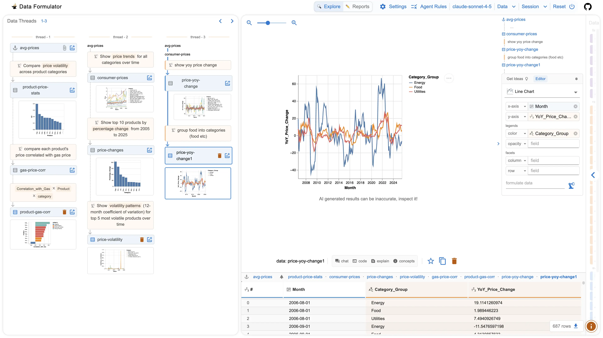

# Data Formulator Chat - Next.js Wrapper

A modern, chat-first interface for Data Formulator built with Next.js, TypeScript, shadcn/ui, and Tailwind CSS.



## 🎯 Overview

This is a complete reimagining of Data Formulator's UI as a clean, embeddable chat interface. It maintains all the powerful AI-driven data analysis capabilities of the original while providing a modern, minimal interface optimized for embedding in web applications.

### Key Features

- 💬 **Chat-First Interface** - Natural language interaction for data analysis
- 📊 **AI-Powered Visualizations** - Automatic chart generation from your questions
- 🎨 **Modern UI** - Built with shadcn/ui and Tailwind CSS
- 🚀 **Easy Deployment** - One-click deploy to Vercel
- 🔌 **Embeddable** - Use as standalone app or embed in your existing application
- 📱 **Responsive** - Works seamlessly on desktop and mobile
- 🔒 **Secure** - Environment-based configuration, no secrets in client code

## 🚀 Quick Start

### Prerequisites

- Node.js 18+ and yarn
- Python 3.12+ (for backend)
- Data Formulator backend running (or deployed)

### 1. Clone and Install

```bash
# Clone this repository
git clone https://github.com/your-org/data-formulator-chat.git
cd data-formulator-chat

# Install dependencies
yarn install
```

### 2. Configure Environment

Create `.env.local`:

```bash
# Python backend URL
NEXT_PUBLIC_PYTHON_BACKEND_URL=http://localhost:5000

# Optional: Analytics
NEXT_PUBLIC_ANALYTICS_ID=your-analytics-id
```

### 3. Run Development Server

```bash
# Start the development server
yarn dev

# Open http://localhost:3000
```

### 4. Start Python Backend (separate terminal)

```bash
# Navigate to Data Formulator directory
cd /path/to/data-formulator

# Activate virtual environment
source venv/bin/activate  # or .\venv\Scripts\activate on Windows

# Start backend
python -m data_formulator --port 5000
```

## 📖 Documentation

### Planning Documents

| Document | Purpose | Audience |
|----------|---------|----------|
| [PLAN_SUMMARY.md](./PLAN_SUMMARY.md) | Executive overview and quick reference | All stakeholders |
| [NEXTJS_WRAPPER_PLAN.md](./NEXTJS_WRAPPER_PLAN.md) | Complete technical architecture | Architects, senior devs |
| [NEXTJS_QUICKSTART.md](./NEXTJS_QUICKSTART.md) | 30-minute setup guide | Developers |
| [DEPLOYMENT_GUIDE.md](./DEPLOYMENT_GUIDE.md) | Production deployment | DevOps, deployment teams |
| [EXAMPLE_IMPLEMENTATIONS.md](./EXAMPLE_IMPLEMENTATIONS.md) | Copy-paste code examples | Frontend developers |

### Quick Links

- 🏃 **New to the project?** Start with [PLAN_SUMMARY.md](./PLAN_SUMMARY.md)
- 🔨 **Want to build a prototype?** Follow [NEXTJS_QUICKSTART.md](./NEXTJS_QUICKSTART.md)
- 🚀 **Ready to deploy?** Check [DEPLOYMENT_GUIDE.md](./DEPLOYMENT_GUIDE.md)
- 💻 **Need code examples?** See [EXAMPLE_IMPLEMENTATIONS.md](./EXAMPLE_IMPLEMENTATIONS.md)

## 🏗️ Project Structure

```
data-formulator-chat/
├── app/
│   ├── page.tsx                   # Main chat page
│   ├── layout.tsx                 # Root layout
│   ├── api/                       # API routes (proxy to Python)
│   └── chat/                      # Chat-specific pages
├── components/
│   ├── ui/                        # shadcn/ui components
│   ├── chat/                      # Chat interface components
│   ├── data/                      # Data upload/preview
│   ├── visualization/             # Chart rendering
│   └── shared/                    # Shared utilities
├── lib/
│   ├── api/                       # API client
│   ├── store/                     # Zustand stores
│   └── utils/                     # Utility functions
├── hooks/                         # Custom React hooks
├── types/                         # TypeScript type definitions
└── public/                        # Static assets
```

## 🎨 Technology Stack

### Frontend
- **Framework**: Next.js 14+ (App Router)
- **Language**: TypeScript 5+
- **UI Library**: [shadcn/ui](https://ui.shadcn.com)
- **Styling**: Tailwind CSS
- **State Management**: Zustand + React Query
- **Charts**: Vega-Lite
- **Forms**: react-hook-form + zod

### Backend
- **Runtime**: Python 3.12+
- **Framework**: Flask
- **AI**: LiteLLM (OpenAI, Anthropic, etc.)
- **Database**: DuckDB (optional)

## 📦 Available Scripts

### Development

```bash
# Start dev server
yarn dev

# Run linter
yarn lint

# Format code
yarn format

# Type check
yarn type-check
```

### Production

```bash
# Build for production
yarn build

# Start production server
yarn start

# Run tests
yarn test
```

## 🔌 Embedding Options

### Option 1: Standalone App

Deploy as a standalone web application:

```
https://your-app.vercel.app/chat
```

### Option 2: iframe Embedding

Embed in any website:

```html
<iframe 
  src="https://your-app.vercel.app/chat?embed=true"
  width="100%"
  height="600px"
  style="border: none; border-radius: 8px;"
></iframe>
```

### Option 3: React Component

Use as a React component in another app:

```typescript
import { EmbeddableChat } from '@your-org/data-formulator-next';

function MyApp() {
  return (
    <EmbeddableChat 
      theme="dark"
      apiUrl="https://your-backend.railway.app"
    />
  );
}
```

## 🚀 Deployment

### Deploy to Vercel (Recommended)

1. **Push to GitHub**
   ```bash
   git push origin main
   ```

2. **Import in Vercel**
   - Go to [vercel.com](https://vercel.com)
   - Click "Import Project"
   - Select your repository
   - Add environment variable: `NEXT_PUBLIC_PYTHON_BACKEND_URL`
   - Click "Deploy"

3. **Done!** Your app is live at `https://your-app.vercel.app`

### Deploy Python Backend

Choose one of these options:

#### Option A: Railway (Recommended)
```bash
railway up
railway domain
```

#### Option B: Google Cloud Run
```bash
gcloud run deploy data-formulator-api --source .
```

#### Option C: Fly.io
```bash
fly launch
fly deploy
```

See [DEPLOYMENT_GUIDE.md](./DEPLOYMENT_GUIDE.md) for detailed instructions.

## 🎯 Usage Examples

### Upload Data and Ask Questions

1. Click "Upload Data" button
2. Drop a CSV, TSV, or JSON file
3. Type your question: "Show me sales by region as a bar chart"
4. Get instant visualizations!

### Example Questions

- "What are the top 5 products by revenue?"
- "Create a line chart showing trends over time"
- "Calculate the average value per category"
- "Show me a scatter plot of price vs quantity"
- "Generate a summary report of key insights"

## 🔧 Configuration

### Environment Variables

#### Frontend (.env.local)

```bash
# Required
NEXT_PUBLIC_PYTHON_BACKEND_URL=https://your-backend.railway.app

# Optional
NEXT_PUBLIC_ANALYTICS_ID=your-analytics-id
NEXT_PUBLIC_SENTRY_DSN=your-sentry-dsn
```

#### Backend

```bash
# At least one model provider required
OPENAI_ENABLED=true
OPENAI_API_KEY=sk-...
OPENAI_MODELS=gpt-4,gpt-3.5-turbo

ANTHROPIC_ENABLED=true
ANTHROPIC_API_KEY=sk-ant-...
ANTHROPIC_MODELS=claude-3-5-sonnet-20241022
```

## 🧪 Testing

```bash
# Run all tests
yarn test

# Run tests in watch mode
yarn test:watch

# Run with coverage
yarn test:coverage

# E2E tests
yarn test:e2e
```

## 📝 Contributing

We welcome contributions! Please see [CONTRIBUTING.md](./CONTRIBUTING.md) for details.

### Development Workflow

1. Fork the repository
2. Create a feature branch: `git checkout -b feature/my-feature`
3. Make your changes
4. Write tests
5. Commit: `git commit -am 'Add new feature'`
6. Push: `git push origin feature/my-feature`
7. Create a Pull Request

## 🐛 Troubleshooting

### Issue: "Failed to connect to backend"

**Solution**: Check that:
- Python backend is running on the correct port
- `NEXT_PUBLIC_PYTHON_BACKEND_URL` is set correctly
- CORS is enabled in Flask backend

### Issue: "Module not found"

**Solution**:
```bash
rm -rf node_modules .next
yarn install
yarn dev
```

### Issue: "Type errors"

**Solution**:
```bash
yarn type-check
# Fix errors, then retry
```

## 📊 Performance

### Lighthouse Scores (Target)

- **Performance**: 95+
- **Accessibility**: 100
- **Best Practices**: 95+
- **SEO**: 100

### Optimization Tips

- Images are optimized with Next.js Image component
- Code splitting via dynamic imports
- API responses cached with React Query
- Minimal bundle size (<200KB initial load)

## 🔒 Security

### Best Practices

- ✅ No API keys in client code
- ✅ Environment variables for secrets
- ✅ Input validation with Zod
- ✅ HTTPS only in production
- ✅ CSP headers configured
- ✅ Rate limiting enabled
- ✅ Sanitized error messages

### Security Checklist

See [DEPLOYMENT_GUIDE.md](./DEPLOYMENT_GUIDE.md#security-checklist) for complete checklist.

## 📈 Roadmap

### v1.0 (MVP) - Current
- [x] Chat interface
- [x] Data upload
- [x] Visualization rendering
- [x] Basic deployment

### v1.1 - Next
- [ ] Authentication (Auth.js)
- [ ] User accounts
- [ ] Saved sessions
- [ ] Share links

### v2.0 - Future
- [ ] Real-time collaboration
- [ ] Custom chart templates
- [ ] Mobile app
- [ ] Advanced analytics

## 💰 Cost Estimation

### Development (Free Tier)
- **Vercel**: Free
- **Railway**: $5 credit/month
- **Total**: ~$0-5/month

### Production (Medium Traffic)
- **Vercel Pro**: $20/month
- **Railway**: ~$15/month
- **Cloud costs**: ~$10-30/month
- **Total**: ~$45-70/month

See [DEPLOYMENT_GUIDE.md](./DEPLOYMENT_GUIDE.md#cost-estimation) for details.

## 📚 Resources

### Documentation
- [Next.js Docs](https://nextjs.org/docs)
- [shadcn/ui](https://ui.shadcn.com)
- [Tailwind CSS](https://tailwindcss.com/docs)
- [Vega-Lite](https://vega.github.io/vega-lite/)
- [Original Data Formulator](https://github.com/microsoft/data-formulator)

### Community
- [Discord](https://discord.gg/mYCZMQKYZb)
- [GitHub Discussions](https://github.com/microsoft/data-formulator/discussions)

## 📄 License

This project is licensed under the MIT License - see the [LICENSE](LICENSE) file for details.

## 🙏 Acknowledgments

- **Data Formulator Team** - Original research and implementation
- **Microsoft Research** - Funding and support
- **shadcn** - Excellent UI component library
- **Vercel** - Amazing deployment platform

## 🤝 Support

- **Issues**: [GitHub Issues](https://github.com/your-org/data-formulator-chat/issues)
- **Discussions**: [GitHub Discussions](https://github.com/your-org/data-formulator-chat/discussions)
- **Discord**: [Join Community](https://discord.gg/mYCZMQKYZb)
- **Email**: support@your-org.com

---

## 🎉 Getting Started Checklist

Before you begin, make sure you have:

- [ ] Read [PLAN_SUMMARY.md](./PLAN_SUMMARY.md)
- [ ] Node.js 18+ installed
- [ ] Python 3.12+ installed
- [ ] Data Formulator backend running or deployed
- [ ] API keys for at least one model provider (OpenAI/Anthropic)
- [ ] Git repository initialized

**Ready?** Follow [NEXTJS_QUICKSTART.md](./NEXTJS_QUICKSTART.md) to build your first prototype in 30 minutes!

---

**Built with ❤️ using Next.js, TypeScript, and shadcn/ui**

**Version**: 1.0.0  
**Last Updated**: November 7, 2025  
**Status**: ✅ Ready for Implementation
