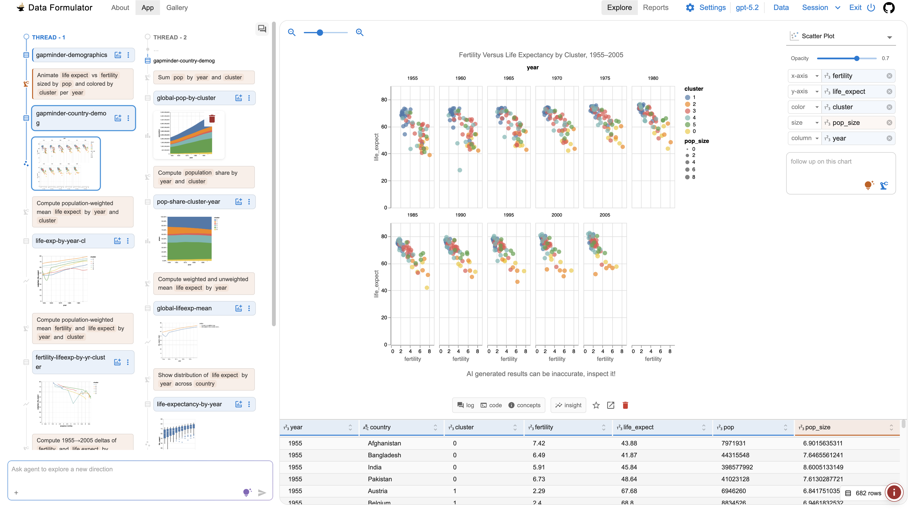

<h1>
     <b>Data Formulator: Create Rich Visualizations with AI</b>
</h1>

<div>
    
[](https://arxiv.org/abs/2408.16119)&ensp;
[](https://opensource.org/licenses/MIT)&ensp;
[](https://youtu.be/3ndlwt0Wi3c)&ensp;
[](https://github.com/microsoft/data-formulator/actions/workflows/python-build.yml)

</div>

Transform data and create rich visualizations iteratively with AI 🪄. Try Data Formulator now in GitHub Codespaces!

[](https://codespaces.new/microsoft/data-formulator?quickstart=1)

<kbd>
  <a target="_blank" rel="noopener noreferrer" href="https://codespaces.new/microsoft/data-formulator?quickstart=1" title="open Data Formulator in GitHub Codespaces"></a>
</kbd>


## News 🔥🔥🔥

- [10-11-2024] Data Formulator python package released! 
  - You can now install Data Formulator using Python and run it locally, easily. [[check it out]](#get-started).
  - Our Codespace configuration is also updated for fast start up ⚡️. [[try it now!]](https://codespaces.new/microsoft/data-formulator?quickstart=1)
  - New exprimental feature: load an image or a messy text, and ask AI parsing and cleaning it for you(!). [[demo]](https://github.com/microsoft/data-formulator/pull/31#issuecomment-2403652717)
  
- [10-01-2024] Initial release of Data Formulator, check out our [[blog]](https://www.microsoft.com/en-us/research/blog/data-formulator-exploring-how-ai-can-help-analysts-create-rich-data-visualizations/) and [[video]](https://youtu.be/3ndlwt0Wi3c)!


## Overview

**Data Formulator** is an application from Microsoft Research that uses large language models to transform data, expediting the practice of data visualization.

Data Formulator is an AI-powered tool for analysts to iteratively create rich visualizations. Unlike most chat-based AI tools where users need to describe everything in natural language, Data Formulator combines *user interface interactions (UI)* and *natural language (NL) inputs* for easier interaction. This blended approach makes it easier for users to describe their chart designs while delegating data transformation to AI. 

## Get Started

Play with Data Formulator with one of the following options:

- **Option 1: Install via Python PIP**
  
  Use Python PIP for an easy setup experience, running locally (recommend: install it in a virtual environment).
  
  ```bash
  # install data_formulator
  pip install data_formulator

  # start data_formulator
  data_formulator 
  
  # alternatively, you can run data formualtor with this command
  python -m data_formulator
  ```

  Data Formulator will be automatically opened in the browser at [http://localhost:5000](http://localhost:5000).

- **Option 2: Codespaces (5 minutes)**
  
  You can also run Data Formualtor in codespace, we have everything pre-configured. For more details, see [CODESPACES.md](CODESPACES.md).
  
  [](https://codespaces.new/microsoft/data-formulator?quickstart=1)

- **Option 3: Working in the developer mode**
  
  You can build Data Formulator locally if you prefer full control over your development environment and the ability to customize the setup to your specific needs. For detailed instructions, refer to [DEVELOPMENT.md](DEVELOPMENT.md).


## Using Data Formulator

Once you’ve completed the setup using either option, follow these steps to start using Data Formulator:

### The basics of data visualization
* Provide OpenAI keys and select a model (GPT-4o suggested) and choose a dataset.
* Choose a chart type, and then drag-and-drop data fields to chart properties (x, y, color, ...) to specify visual encodings.

https://github.com/user-attachments/assets/0fbea012-1d2d-46c3-a923-b1fc5eb5e5b8


### Create visualization beyond the initial dataset (powered by 🤖)
* You can type names of **fields that do not exist in current data** in the encoding shelf:
    - this tells Data Formulator that you want to create visualizions that require computation or transformation from existing data,
    - you can optionally provide a natural language prompt to explain your intent to clarify your intent (not necessary when field names are self-explanatory).
* Click the **Formulate** button.
    - Data Formulator will transform data and instantiate the visualization based on the encoding and prompt.
* Inspect the data, chart and code.
* To create a new chart based on existing ones, follow up in natural language:
    - provide a follow up prompt (e.g., *``show only top 5!''*),
    - you may also update visual encodings for the new chart.

https://github.com/user-attachments/assets/160c69d2-f42d-435c-9ff3-b1229b5bddba

https://github.com/user-attachments/assets/c93b3e84-8ca8-49ae-80ea-f91ceef34acb

Repeat this process as needed to explore and understand your data. Your explorations are trackable in the **Data Threads** panel. 

## Developers' Guide

Follow the [developers' instructions](DEVELOPMENT.md) to build your new data analysis tools on top of Data Formulator.

## Research Papers
* [Data Formulator 2: Iteratively Creating Rich Visualizations with AI](https://arxiv.org/abs/2408.16119)

```
@article{wang2024dataformulator2iteratively,
      title={Data Formulator 2: Iteratively Creating Rich Visualizations with AI}, 
      author={Chenglong Wang and Bongshin Lee and Steven Drucker and Dan Marshall and Jianfeng Gao},
      year={2024},
      booktitle={ArXiv preprint arXiv:2408.16119},
}
```

* [Data Formulator: AI-powered Concept-driven Visualization Authoring](https://arxiv.org/abs/2309.10094)

```
@article{wang2023data,
  title={Data Formulator: AI-powered Concept-driven Visualization Authoring},
  author={Wang, Chenglong and Thompson, John and Lee, Bongshin},
  journal={IEEE Transactions on Visualization and Computer Graphics},
  year={2023},
  publisher={IEEE}
}
```


## Contributing

This project welcomes contributions and suggestions. Most contributions require you to
agree to a Contributor License Agreement (CLA) declaring that you have the right to,
and actually do, grant us the rights to use your contribution. For details, visit
https://cla.microsoft.com.

When you submit a pull request, a CLA-bot will automatically determine whether you need
to provide a CLA and decorate the PR appropriately (e.g., label, comment). Simply follow the
instructions provided by the bot. You will only need to do this once across all repositories using our CLA.

This project has adopted the [Microsoft Open Source Code of Conduct](https://opensource.microsoft.com/codeofconduct/).
For more information see the [Code of Conduct FAQ](https://opensource.microsoft.com/codeofconduct/faq/)
or contact [opencode@microsoft.com](mailto:opencode@microsoft.com) with any additional questions or comments.

## Trademarks

This project may contain trademarks or logos for projects, products, or services. Authorized use of Microsoft 
trademarks or logos is subject to and must follow 
[Microsoft's Trademark & Brand Guidelines](https://www.microsoft.com/en-us/legal/intellectualproperty/trademarks/usage/general).
Use of Microsoft trademarks or logos in modified versions of this project must not cause confusion or imply Microsoft sponsorship.
Any use of third-party trademarks or logos are subject to those third-party's policies.
