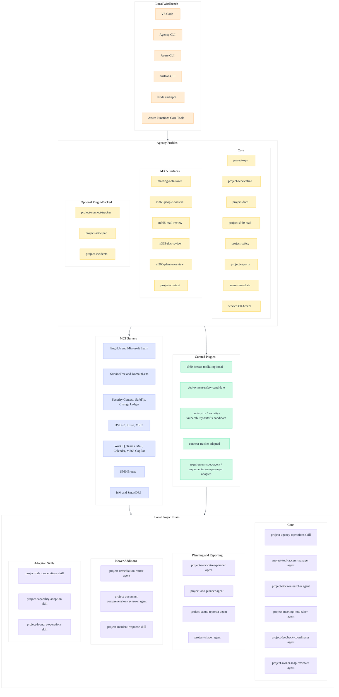

<!-- markdownlint-disable MD013 -->

# Agency Integration Starter

Reusable private starter for projects that want Microsoft internal Agency CLI,
MCP servers, VS Code integration, Azure tooling, WorkIQ/M365 context, and curated
marketplace plugins without copying a single product repo's assumptions.

## Requirements

- **Windows only.** [verify-tooling.ps1](scripts/verify-tooling.ps1)'s `-Install`
  path uses `winget` for dependency installation and reads Machine/User-scoped
  environment variables, neither of which exist on macOS/Linux (the
  Machine/User environment-variable scope call throws
  `PlatformNotSupportedException` on non-Windows .NET). This has not been
  tested or adapted for macOS or Linux.
- PowerShell (`pwsh` or Windows PowerShell) to run the scripts.
- Microsoft-internal Agency CLI access; this repo assumes an Agency build
  targeting Windows (`agency --version` reports `target: x86_64-windows` on a
  verified machine). macOS/Linux Agency CLI availability is unconfirmed.

## Positioning

Agency Integration Starter is an optional add-on for ACT Edition-style
workspaces used by Microsoft internal developers. It layers Microsoft-internal
Agency CLI, MCP servers, M365/WorkIQ context, Azure tooling, and curated
marketplace plugin access onto an existing project without replacing that
project's docs, `.github` brain, or implementation choices.

| Layer | Owns |
| --- | --- |
| ACT Edition | Reasoning framework, base agents/skills/prompts, safety, critical-thinking discipline |
| Agency Integration Starter | Microsoft internal tool access, MCP profiles, EMU auth, Azure/VS Code tooling setup, plugin adoption |
| Project repo | Domain docs, project-specific agents/skills, implementation, operational policy |

This starter is designed for ACT Edition-style repos, but it can be installed
into any git repo. It is intended for Microsoft internal use. Keep it opt-in:
projects that do not need Microsoft-internal tools should not inherit the
MCP/M365/plugin surface by default.

## What This Gives You

- Workspace MCP configuration for documentation, Azure safety, ServiceTree,
  release signals, Kusto, and implementation support.
- Narrow Agency profiles for project operations, docs, ServiceTree, S360
  read-only lookup, safety, reports, meeting notes, people context, mail,
  document review, Planner, Azure/SFI remediation, optional Service360/Breeze
  work, Microsoft Connect goal tracking, ADO Requirement/Implementation Spec
  generation, and incident/on-call lookup.
- VS Code extension recommendations for Agency, Azure Functions, Bicep,
  Azure Resources, Cosmos DB, Static Web Apps, PowerShell, TOML (`agency.toml`),
  Markdownlint, GitHub Pull Requests, and Jupyter/Python (for editing and
  running the PySpark notebooks the Fabric profile template generates).
- Local project agents plus routing skills (Agency operations, incident
  response, Fabric operations, on-need capability adoption, and Microsoft
  Foundry adoption) that keep tool access, plugin adoption, capability pull, and
  project triage repeatable.
- A capability catalog ([agency-mcp-capabilities.md](docs/agency-mcp-capabilities.md))
  covering both the Agency MCP surface and Microsoft Foundry capabilities, so a
  project can pull tools on need instead of adopting the whole surface.
- A verification script that checks the local machine without reading private
  M365 content.
- A local `agency/VERSION.json` snapshot for detecting tool drift.
- A root installer, [Install-AgencyStarter.ps1](../Install-AgencyStarter.ps1), that
  merges the starter into existing repos without overwriting project history.

## Tooling Map



## Quick Start

1. Follow [Setup GitHub EMU and Agency](docs/setup-github-emu-agency.md).
2. Open this repo in VS Code.
3. Reload VS Code after installing recommended extensions.
4. Install or verify local dependencies.
5. Use an Agency profile.

On a fresh Windows machine, dependency install needs `winget`. If a newly
installed tool is not visible immediately, open a new terminal and rerun the
command. The script enforces Node.js 24+.

```powershell
./agency/scripts/verify-tooling.ps1 -Install
./agency/scripts/verify-tooling.ps1
./agency/scripts/verify-tooling.ps1 -UpdateVersionFile
```

Verification-only mode does not install or update tools. It exits nonzero when
a required command or extension is missing, a minimum version is not met, a
native check fails, or the installed versions drift from local
`agency/VERSION.json`. Review expected tool changes, then use
`-UpdateVersionFile` to establish the new verified baseline.

Prefer `--profile-only` so narrow tasks do not load every workspace MCP server.

```powershell
agency copilot --profile-only project-servicetree
agency copilot --profile-only project-ops
agency copilot --profile-only project-docs
agency copilot --profile-only meeting-note-taker
agency copilot --profile-only project-reports
agency copilot --profile-only project-incidents
```

## Profiles

| Profile | Purpose |
| --- | --- |
| `project-ops` | Routine project operations: docs, release/comms signals, Kusto, and Azure DevOps |
| `project-servicetree` | ServiceTree-only reads: service IDs, lifecycle, ownerships, subscription associations |
| `project-docs` | Documentation research with EngHub and Microsoft Learn only |
| `meeting-note-taker` | Named meeting metadata, Teams meeting context, transcript availability, and meeting-note workflows |
| `m365-people-context` | Narrow people/org context through Graph and M365 user surfaces |
| `m365-mail-review` | Mail-specific review when the user explicitly names the mailbox/thread scope |
| `m365-doc-review` | OneDrive, SharePoint, and Word document review for explicitly named files or sites |
| `m365-planner-review` | Planner task and plan review for explicitly named plans |
| `project-s360-read` | Read-only S360/Breeze and ServiceTree KPI/action-item lookup |
| `project-safety` | Deployment/security context with Security Context, SafeFly, Change Ledger, DomainLens, DVD-R, and MRC |
| `project-reports` | Core solution-owner reporting with S360 Breeze + ServiceTree only |
| `project-context` | Sensitive M365 context: WorkIQ, Teams, Mail, Calendar, M365 user, and M365 Copilot |
| `azure-remediate` | Azure/SFI remediation profile for security context, deployment safety, change history, and vulnerability workflows |
| `service360-breeze` | Optional Service360/Breeze profile for teams that manage Service360/SFI KPIs |
| `project-connect-tracker` | Optional weekly Microsoft Connect goal tracking from mail/calendar/Teams/ADO/WorkIQ signals (plugin `connect-tracker`) |
| `project-ado-spec` | Optional Requirement/Implementation Spec generation from a named ADO work item, delivered via PR (plugins `requirement-spec-agent`, `implementation-spec-agent`) |
| `project-incidents` | Optional incident investigation and on-call/DRI lookup through Incident Management and SmartDRI |
| `project-fabric` | Template: general Microsoft Fabric work via `microsoft/skills-for-fabric` — not yet exercised, verify before use |
| `project-fabric-notebooks` | Template: generate DQ/data-enrichment PySpark notebooks for Fabric (plugins `dq-coworker`, `raw-2-enrich`) — not yet exercised |
| `project-fabric-review` | Template: Power BI/Fabric lineage, semantic model review, FDA config (plugins `tompo-fabriclineage`, `semantic-model-disambiguation`, `semantic-model-fda-creator`) — not yet exercised |
| `project-fabric-security` | Template: PII/PHI detection and de-identification (plugin `MaskIQ`) — not yet exercised |

Prefer `--profile-only <name>` for Agency CLI sessions. It ignores ambient
workspace MCP sources and prevents the session from loading every server in
[.mcp.json](../.mcp.json). Start narrow, then escalate only when the task needs
more evidence.

## Consent Boundaries

- WorkIQ, Teams, Mail, Calendar, OneDrive, SharePoint, and M365 Copilot can read
  personal or tenant work data. Use the narrowest matching profile first;
  reserve `project-context` for tasks that explicitly need multiple M365
  surfaces.
- Transcript or meeting-AI tools should be called only for a named meeting with
  explicit approval.
- Remediation plugins can edit code or draft PRs. Use them only for active
  findings after confirming write behavior.

## Local Skill And Agents

| Artifact | Use |
| --- | --- |
| [project-agency-operations](../.github/skills/local/project-agency-operations/SKILL.md) | Skill for choosing Agency profiles, MCPs, M365 boundaries, and plugin adoption paths |
| [project agent roster](docs/project-agent-roster.md) | Local roster template for project agents and their MCP/profile boundaries |
| [project-tool-access-manager](../.github/agents/local/project-tool-access-manager.agent.md) | Read-only agent for access-state audits and verification command recommendations |
| [project-docs-researcher](../.github/agents/local/project-docs-researcher.agent.md) | Read-only documentation-grounded research agent |
| [project-meeting-note-taker](../.github/agents/local/project-meeting-note-taker.agent.md) | Read-only meeting outcome-note drafter for named meetings |
| [project-feedback-coordinator](../.github/agents/local/project-feedback-coordinator.agent.md) | Read-only stakeholder feedback synthesis agent |
| [project-owner-map-reviewer](../.github/agents/local/project-owner-map-reviewer.agent.md) | Read-only owner-map consistency reviewer |
| [project-servicetree-planner](../.github/agents/local/project-servicetree-planner.agent.md) | Read-only ServiceTree identity, ownership, lifecycle, and subscription-binding planner |
| [project-ado-planner](../.github/agents/local/project-ado-planner.agent.md) | Read-only ADO and Planner alignment analyst |
| [project-status-reporter](../.github/agents/local/project-status-reporter.agent.md) | Read-only project status and stakeholder-rollup analyst |
| [project-triager](../.github/agents/local/project-triager.agent.md) | Read-only agent for converting project evidence and parent-supplied MCP results into next-action briefs |
| [project-remediation-router](../.github/agents/local/project-remediation-router.agent.md) | Read-only agent that recommends the narrowest safe remediation path before a write-capable profile/plugin loads |
| [project-document-comprehension-reviewer](../.github/agents/local/project-document-comprehension-reviewer.agent.md) | Read-only adversarial no-context comprehension reviewer for stand-alone documents |
| [project-incident-response](../.github/skills/local/project-incident-response/SKILL.md) | Skill for routing incident investigation and on-call/DRI lookup through `project-incidents` |
| [project-fabric-operations](../.github/skills/local/project-fabric-operations/SKILL.md) | Skill template for routing Microsoft Fabric work through the `project-fabric*` profiles — not yet exercised against a real workspace |
| [project-capability-adoption](../.github/skills/local/project-capability-adoption/SKILL.md) | Skill for pulling a single Agency MCP or Foundry capability on need from the [capability catalog](docs/agency-mcp-capabilities.md), instead of adopting the whole surface |
| [project-foundry-operations](../.github/skills/local/project-foundry-operations/SKILL.md) | Skill for on-need adoption of Microsoft Foundry capabilities (IQ family, Toolboxes, Tool Search, Routines, autopilot agents, Agent Optimizer, Memory, Claude) — awareness-stage, a different runtime than Agency profiles |

The agents intentionally do not call MCP tools, run terminal commands, install
plugins, or read M365 content. The parent session owns live tool calls and passes
approved summaries into the agents.

## Files To Customize

| File | What to change |
| --- | --- |
| [.mcp.json](../.mcp.json) | Add project-specific MCP servers or Kusto cluster defaults |
| [agency.toml](../agency.toml) | Tune Agency profiles and optional plugins |
| [.vscode/extensions.json](../.vscode/extensions.json) | Add project-specific VS Code recommendations |
| `agency/VERSION.json` (generated locally) | Refresh tool version snapshots when dependencies move |
| [agency/docs/tooling-guide.md](docs/tooling-guide.md) | Document project-specific workflows |

## Merge Into An Existing Project

Preview the merge first:

```powershell
./Install-AgencyStarter.ps1 -TargetPath C:/Development/<project>
```

Apply it when the plan looks right:

```powershell
./Install-AgencyStarter.ps1 -TargetPath C:/Development/<project> -Apply
```

The installer copies additive files, appends missing `.gitignore` patterns,
deep-merges JSON recommendation/config files, and appends starter profiles to an
existing `agency.toml`. MCP servers are installed by merging their `.mcp.json`
server entries so VS Code and Agency know how to launch them. The installer does
not overwrite existing project files unless you pass `-Force`.

## Related Docs

- [Agency MCP capabilities catalog](docs/agency-mcp-capabilities.md)
- [Tooling guide](docs/tooling-guide.md)
- [Project agent roster](docs/project-agent-roster.md)
- [Project MCP capabilities](docs/project-mcp-capabilities.md)
- [Setup GitHub EMU and Agency](docs/setup-github-emu-agency.md)
- [M365 and transcript access](docs/m365-transcript-access.md)
- [Plugin adoption checklist](docs/plugin-adoption-checklist.md)
- [What's new](docs/whats-new.md)
