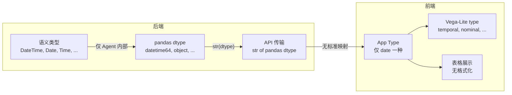

# 17 — 统一日期/时间类型体系

> **状态**: 设计文档
> **创建日期**: 2026-04-27
> **分支**: `feature/plugin-architecture`

## 1. 目标

为项目建立完整、一致的日期/时间类型体系，覆盖前端类型枚举、表格展示格式化、后端类型推断、Agent 上下文描述四个层面。

### 目标

- 前端 `Type` 枚举能区分"仅日期"、"日期+时间"、"仅时间"、"时间间隔"四种场景
- 数据表格对日期/时间字段有本地化的可读格式，而非原始 ISO 字符串
- 后端 API 向前端传递标准化的类型标签，不再是裸 pandas dtype 字符串
- Agent/LLM 上下文中的类型描述与前端保持一致
- SQL/外部数据源的 DATE / TIME / TIMESTAMP / INTERVAL 不再全部折叠为单一 `Date`

### 非目标

- 不引入用户可配置的日期格式偏好（后续增强）
- 不处理时区转换/显示（后续增强）
- 不改变后端语义类型系统（`semantic_types.py` 的 15 种时间语义类型保持不变）
- 不改变 Vega-Lite 编码侧的 `temporal` / `ordinal` 映射逻辑

---

## 2. 现状分析

### 2.1 前端类型系统

`src/data/types.ts` 定义了 `Type` 枚举，只有一个时间类型 `Date`：

```typescript
// src/data/types.ts  L4-L13
export enum Type {
    String = 'string',
    Boolean = 'boolean',
    Integer = 'integer',
    Number = 'number',
    Date = 'date',
    Auto = 'auto'
    // Time = 'time',       // 被注释
    // DateTime = 'datetime', // 被注释
}
```

暴露给用户可选的 `TypeList` 更少：`[Auto, Number, Date, String]`。

### 2.2 后端语义类型系统

`py-src/data_formulator/agents/semantic_types.py` 有丰富的时间语义类型（15 种）：

| 类别 | 类型 |
|------|------|
| DateTime 族 | DateTime, Date, Time, Timestamp |
| DateGranule 族 | Year, Quarter, Month, Week, Day, Hour, YearMonth, YearQuarter, YearWeek, Decade |
| Duration | Duration |

但这些只在 Agent/LLM 和图表语义层使用，**未映射到前端 `Type` 枚举**。

### 2.3 类型映射断层



核心问题：后端 `routes/tables.py` 通过 `"type": c.dtype`（即 `str(df[col].dtype)`）传递类型，前端收到的是 `datetime64[ns]`、`object` 等 pandas 原始字符串，没有统一的解析映射。

### 2.4 前端表格展示

`src/views/ViewUtils.tsx` 的 `formatCellValue` 只对数字做了千分位格式化，日期类型没有任何特殊处理：

```typescript
// src/views/ViewUtils.tsx  L55-L71
export const formatCellValue = (value: any): string => {
    if (value == null) return '';
    if (typeof value === 'number') {
        // ... 数字格式化
    }
    if (typeof value === 'boolean') return String(value);
    if (typeof value === 'object') return String(value);
    return String(value);  // 日期 ISO 字符串走这里，原样输出
};
```

`DataFrameTable.tsx` 的预览表格同样只做 `String(v)` 截断，无类型感知。

---

## 3. 问题清单

### P1：前端表格日期展示无格式化

ISO 字符串 `2024-01-15T14:30:00.000Z` 原样显示，可读性差。用户期望看到本地化的格式如 `2024/1/15 14:30`。

**涉及文件**：
- `src/views/ViewUtils.tsx` — `formatCellValue` 无日期分支
- `src/views/DataFrameTable.tsx` — 预览表格 `String(v)` 无类型感知
- `src/views/SelectableDataGrid.tsx` — 主表格渲染

### P2：类型检测过于宽松

`testDate` 使用 `Date.parse(v)` 判断，在 V8 引擎下极其宽松：

```typescript
// src/data/types.ts  L38
const testDate = (v: any): boolean => !isNaN(Date.parse(v));
```

纯数字如 `"2024"` 会被 `Date.parse` 成功解析为合法日期，年份列可能被误判为 `Date` 类型。后端图表语义模块 `chart_semantics.py` 已独立实现了更严格的 `looksLikeDate` 检查（要求以数字或月份名开头），但前端类型推断没有跟进。

### P3：前端缺失 Time 和 DateTime 类型

`src/app/tableThunks.ts` 的 `convertSqlTypeToAppType` 把 SQL 的 DATE / TIME / TIMESTAMP 全部折叠为 `Type.Date`：

```typescript
// src/app/tableThunks.ts  L378-L379
} else if (sqlType.includes('DATE') || sqlType.includes('TIME') || sqlType.includes('TIMESTAMP')) {
    return Type.Date;
}
```

用户无法区分"仅日期"、"日期+时间"、"仅时间"字段。

### P4：后端 API 传递裸 pandas dtype 字符串

`routes/tables.py` 和 `data_connector.py` 直接传递 `str(df[col].dtype)`：

```python
# routes/tables.py  L198
col_entry: dict = {"name": c.name, "type": c.dtype}

# data_connector.py  preview 路径
columns = [{"name": col, "type": str(df[col].dtype)} for col in df.columns]
```

前端收到 `datetime64[ns]`、`datetime64[ns, UTC]`、`object` 等原始字符串，类型映射不统一。

### P5：Agent 上下文中类型描述不一致

| 模块 | 类型描述 |
|------|----------|
| `context.py` `build_lightweight_table_context` | 简化为 `datetime` |
| `agent_data_load.py` 系统提示 | 只说 `string, number, date` |
| `agent_utils.py` `get_field_summary` | 用 raw pandas dtype 如 `datetime64[ns, UTC]` |
| `semantic_types.py` 语义类型 | DateTime, Date, Time, Timestamp 等 |

Agent 在不同阶段看到的类型命名不同，可能影响推断质量。

### P6：Duration / 时间间隔无前端对应

后端语义系统有 `Duration` 类型，但前端完全不识别。时间间隔数据（如 SQL 的 `INTERVAL`、数据中的 "2 hours"、"3 days"）没有专门处理。

---

## 4. 影响范围

| 受影响模块 | 影响描述 | 严重度 |
|:-----------|:---------|:------:|
| 前端数据表格 | 日期/时间原样显示 ISO 字符串，无本地化格式 | 高 |
| 类型推断 (`types.ts`) | 年份/数字 ID 可能被误判为日期 | 中 |
| 用户类型选择 (`TypeList`) | 用户只能选 Date，无法指定更精确的时间类型 | 中 |
| Agent 分析代码生成 | Agent 不知道列是纯日期还是日期时间，可能生成不当分析代码 | 中 |
| 图表编码 | 所有时间类型统一映射为 `temporal`，无法按子类型优化轴格式 | 低 |
| SQL/DB 连接 | DATE/TIME/TIMESTAMP/INTERVAL 全部折叠为 `Date` | 中 |
| 数据导出/序列化 | 无统一格式约定，ISO 和 locale 格式混杂 | 低 |
| 数据预览表格 | `DataFrameTable` 对所有值 `String(v)` 截断，无类型感知 | 中 |

---

## 5. 设计方案

### 5.1 前端 Type 枚举扩展

新增 3 个类型：`DateTime`、`Time`、`Duration`。

```typescript
export enum Type {
    String = 'string',
    Boolean = 'boolean',
    Integer = 'integer',
    Number = 'number',
    Date = 'date',           // 仅日期：2024-01-15
    DateTime = 'datetime',   // 日期+时间：2024-01-15T14:30:00   (新增)
    Time = 'time',           // 仅时间：14:30:00                 (新增)
    Duration = 'duration',   // 时间间隔：2h 30m                 (新增)
    Auto = 'auto',
}

export const TypeList = [Type.Auto, Type.Number, Type.Date, Type.DateTime, Type.Time, Type.String];
```

**不新增到 App Type 的语义类型**（由 `semantic_types.py` 层覆盖即可）：

| 不新增 | 理由 |
|--------|------|
| Timestamp | Unix 时间戳导入后应转为 DateTime，不需要单独 App 类型 |
| Year / Month / Day / Hour | 时间粒度是语义概念，App 层用 Number 或 String 即可 |
| YearMonth / YearQuarter / YearWeek | 同上，语义层已有覆盖 |

### 5.2 统一格式规范

#### 5.2.1 存储格式（内部传输/持久化）

| App Type | 存储格式 | 示例 |
|:---------|:---------|:-----|
| `Date` | ISO 8601 日期 `YYYY-MM-DD` | `2024-01-15` |
| `DateTime` | ISO 8601 完整 `YYYY-MM-DDTHH:mm:ssZ` | `2024-01-15T14:30:00Z` |
| `Time` | ISO 8601 时间 `HH:mm:ss` | `14:30:00` |
| `Duration` | 毫秒数（内部），ISO 8601 Duration 可选 | `9000000` / `PT2H30M` |

#### 5.2.2 展示格式（前端表格默认）

| App Type | 展示方式 | 示例（zh-CN） | 示例（en-US） |
|:---------|:---------|:--------------|:-------------|
| `Date` | `toLocaleDateString()` | `2024/1/15` | `1/15/2024` |
| `DateTime` | `toLocaleString()` | `2024/1/15 14:30:00` | `1/15/2024, 2:30:00 PM` |
| `Time` | `toLocaleTimeString()` | `14:30:00` | `2:30:00 PM` |
| `Duration` | 可读格式化 | `2小时30分` | `2h 30m` |

使用 `Intl.DateTimeFormat` 做本地化，无需第三方库。

### 5.3 类型推断策略

#### 5.3.1 前端值推断（`testDate` 系列）

替换过于宽松的 `Date.parse`，采用正则预检 + 解析验证双重策略：

```typescript
// 伪代码 — 新的推断函数

const DATE_RE = /^\d{4}[-/]\d{1,2}[-/]\d{1,2}$/;
const DATETIME_RE = /^\d{4}[-/]\d{1,2}[-/]\d{1,2}[T ]\d{1,2}:\d{2}/;
const TIME_RE = /^\d{1,2}:\d{2}(:\d{2})?(\.\d+)?$/;
const DURATION_RE = /^P(\d+Y)?(\d+M)?(\d+D)?(T(\d+H)?(\d+M)?(\d+(\.\d+)?S)?)?$/i;

const testDateTime = (v: any): boolean => {
    if (v instanceof Date) return true;
    if (typeof v !== 'string') return false;
    return DATETIME_RE.test(v.trim()) && !isNaN(Date.parse(v));
};

const testDate = (v: any): boolean => {
    if (typeof v !== 'string') return false;
    return DATE_RE.test(v.trim()) && !isNaN(Date.parse(v));
};

const testTime = (v: any): boolean => {
    if (typeof v !== 'string') return false;
    return TIME_RE.test(v.trim());
};
```

推断优先级调整为：Boolean → Integer → DateTime → Date → Time → Duration → Number → String（更具体的类型优先）。

#### 5.3.2 SQL 类型映射

```typescript
// 伪代码 — convertSqlTypeToAppType 更新
if (sqlType.includes('TIMESTAMP') || sqlType === 'DATETIME') {
    return Type.DateTime;
} else if (sqlType.includes('DATE')) {
    return Type.Date;
} else if (sqlType === 'TIME') {
    return Type.Time;
} else if (sqlType.includes('INTERVAL')) {
    return Type.Duration;
}
```

#### 5.3.3 后端 API 类型标准化

在 `routes/tables.py` 和 `data_connector.py` 中，将 pandas dtype 映射为标准类型标签后再传给前端：

```python
# 伪代码 — normalize_dtype_to_app_type
def normalize_dtype_to_app_type(dtype_str: str) -> str:
    dtype_str = dtype_str.lower()
    if 'datetime' in dtype_str or 'timestamp' in dtype_str:
        return 'datetime'
    elif dtype_str == 'date' or dtype_str.startswith('date'):
        return 'date'
    elif 'timedelta' in dtype_str:
        return 'duration'
    elif 'int' in dtype_str:
        return 'integer'
    elif 'float' in dtype_str or 'double' in dtype_str:
        return 'number'
    elif 'bool' in dtype_str:
        return 'boolean'
    else:
        return 'string'
```

### 5.4 VL 编码映射扩展

`getDType` 和 `convertTypeToDtype` 需更新：

| App Type | VL dtype |
|----------|----------|
| Date | temporal |
| DateTime | temporal |
| Time | temporal |
| Duration | quantitative |

### 5.5 Agent 提示词对齐

| 模块 | 当前描述 | 建议描述 |
|------|----------|----------|
| `agent_data_load.py` 系统提示 | `string, number, date` | `string, number, date, datetime, time, duration` |
| `context.py` `build_lightweight_table_context` | `datetime` | 按 5.3.3 标准化后的 `date` / `datetime` / `time` |
| `agent_utils.py` `infer_ts_datatype` | `datetime64` → `Date` | `datetime64` → `DateTime` |

---

## 6. 文件变更清单

### 6.1 前端核心 — 类型定义与推断

| 文件 | 改动 |
|------|------|
| `src/data/types.ts` | 新增 `DateTime`, `Time`, `Duration` 枚举值；更新 `TypeList`；新增 `testDateTime`, `testTime`, `testDuration` 和对应 `coerce` 函数；收紧 `testDate` 正则 |
| `src/data/utils.ts` | 更新 `inferTypeFromValueArray` 推断优先级；更新 `convertTypeToDtype`；更新 `coerceValueArrayFromTypes` |

### 6.2 前端核心 — 表格展示

| 文件 | 改动 |
|------|------|
| `src/views/ViewUtils.tsx` | `formatCellValue` 增加 Date/DateTime/Time/Duration 格式化分支；`getColumnAlign` 更新（Duration 右对齐）；`getIconFromType` 增加新类型图标 |
| `src/views/DataFrameTable.tsx` | `getCell` 感知列类型，对时间类字段做本地化展示 |
| `src/views/SelectableDataGrid.tsx` | 列头图标适配新类型 |
| `src/views/DataView.tsx` | 列定义的 `format` 回调支持新类型 |
| `src/icons.tsx` | 新增 `DateTimeIcon`, `TimeIcon`, `DurationIcon`（可复用/微调 `DateIcon`） |

### 6.3 前端映射层

| 文件 | 改动 |
|------|------|
| `src/app/tableThunks.ts` | `convertSqlTypeToAppType` 区分 DATE / TIME / TIMESTAMP / INTERVAL |
| `src/components/ComponentType.tsx` | `DictTable.metadata` 类型定义无需改（`type: Type` 已覆盖新枚举） |
| `src/views/EncodingBox.tsx` | 确认 `encoding.dtype` 的 temporal 映射兼容新类型 |

### 6.4 后端 — API 类型标准化

| 文件 | 改动 |
|------|------|
| `py-src/.../routes/tables.py` | 列类型传递时调用 `normalize_dtype_to_app_type` |
| `py-src/.../data_connector.py` | preview 列类型标准化 |
| `py-src/.../datalake/parquet_utils.py` | `get_column_info` / `get_arrow_column_info` 标准化 dtype |

### 6.5 后端 — Agent 上下文

| 文件 | 改动 |
|------|------|
| `py-src/.../agents/agent_data_load.py` | 系统提示扩展为 `string, number, date, datetime, time, duration` |
| `py-src/.../agents/context.py` | `build_lightweight_table_context` 使用标准化类型标签 |
| `py-src/.../agents/agent_utils.py` | `infer_ts_datatype` 扩展 `datetime64` → `datetime` |
| `py-src/.../prompts/chart_creation_guide.py` | Datetime handling 指引与新类型对齐 |

### 6.6 测试

| 文件 | 改动 |
|------|------|
| `tests/frontend/unit/data/coerceDate.test.ts` | 扩展覆盖 DateTime, Time, Duration |
| 新增测试文件 | `testDateTime`, `testTime`, `testDuration` 推断测试 |
| 新增测试文件 | `formatCellValue` 日期格式化测试 |
| 新增测试文件 | `normalize_dtype_to_app_type` 后端映射测试 |

---

## 7. 详细开发步骤

### Phase 1：核心类型定义与推断（前端+后端）

**预计工作量**：1-2 天

#### Step 1.1 — 扩展前端 Type 枚举

文件：`src/data/types.ts`

- 取消 `Time` / `DateTime` 的注释，新增 `Duration`
- 更新 `TypeList` 加入新类型
- 新增 `testDateTime`、`testTime`、`testDuration` 函数
- 收紧 `testDate`：要求严格匹配 `YYYY-MM-DD` 格式
- 新增 `coerceDateTime`、`coerceTime`、`coerceDuration` 函数
- 更新 `CoerceType`、`TestType` 映射表

```typescript
// testDate 收紧后的实现
const DATE_ONLY_RE = /^\d{4}[-/]\d{1,2}[-/]\d{1,2}$/;
const testDate = (v: any): boolean => {
    if (typeof v !== 'string') return false;
    return DATE_ONLY_RE.test(v.trim()) && !isNaN(Date.parse(v));
};

// testDateTime: 要求日期 + 时间部分
const DATETIME_RE = /^\d{4}[-/]\d{1,2}[-/]\d{1,2}[T ]\d{1,2}:\d{2}/;
const testDateTime = (v: any): boolean => {
    if (v instanceof Date) return true;
    if (typeof v !== 'string') return false;
    return DATETIME_RE.test(v.trim()) && !isNaN(Date.parse(v));
};

// testTime: 仅时间
const TIME_RE = /^\d{1,2}:\d{2}(:\d{2})?(\.\d+)?(Z|[+-]\d{2}:\d{2})?$/;
const testTime = (v: any): boolean => {
    if (typeof v !== 'string') return false;
    return TIME_RE.test(v.trim());
};
```

验收标准：
- `testDate("2024-01-15")` → true
- `testDate("2024-01-15T14:30:00Z")` → false（应归类为 DateTime）
- `testDateTime("2024-01-15T14:30:00Z")` → true
- `testDate("2024")` → false（不再误判年份为日期）
- `testTime("14:30:00")` → true
- `testTime("2024-01-15")` → false

#### Step 1.2 — 更新前端类型推断

文件：`src/data/utils.ts`

- `inferTypeFromValueArray` 推断优先级改为：`Boolean → Integer → DateTime → Date → Time → Duration → Number → String`
- `convertTypeToDtype` 增加新类型映射
- `coerceValueArrayFromTypes` 增加新类型分支

#### Step 1.3 — 更新 SQL 类型映射

文件：`src/app/tableThunks.ts`

- `convertSqlTypeToAppType` 区分 `TIMESTAMP/DATETIME` → `Type.DateTime`、`DATE` → `Type.Date`、`TIME` → `Type.Time`、`INTERVAL` → `Type.Duration`

#### Step 1.4 — 后端 API 类型标准化

文件：
- `py-src/data_formulator/datalake/parquet_utils.py` — 新增 `normalize_dtype_to_app_type()`
- `py-src/data_formulator/routes/tables.py` — 列类型调用标准化函数
- `py-src/data_formulator/data_connector.py` — preview 类型标准化

实现 `normalize_dtype_to_app_type` 并在所有向前端传递列类型的位置统一使用。

#### Step 1.5 — VL 映射扩展

文件：`src/data/types.ts`

- `getDType` 增加 `DateTime → temporal`、`Time → temporal`、`Duration → quantitative`

文件：`src/data/utils.ts`

- `convertTypeToDtype` 增加新类型映射

**Phase 1 验收**：
- 从 CSV 导入含日期/时间列的数据，类型推断正确
- 从 SQL 数据库导入 DATE/TIME/TIMESTAMP 列，类型分别映射为 Date/Time/DateTime
- 后端 API 列表接口返回标准化类型字符串

---

### Phase 2：前端展示格式化（表格 + 图标）

**预计工作量**：1 天

#### Step 2.1 — 实现日期格式化函数

文件：`src/views/ViewUtils.tsx`

```typescript
// 伪代码 — formatCellValue 增加日期分支
export const formatCellValue = (value: any, dataType?: Type): string => {
    if (value == null) return '';

    // 数字格式化（已有）
    if (typeof value === 'number') { /* ... existing ... */ }

    // 日期/时间格式化（新增）
    if (dataType === Type.DateTime || dataType === Type.Date || dataType === Type.Time) {
        return formatTemporalValue(value, dataType);
    }
    if (dataType === Type.Duration) {
        return formatDuration(value);
    }

    if (typeof value === 'boolean') return String(value);
    if (typeof value === 'object') return String(value);
    return String(value);
};

const formatTemporalValue = (value: any, dataType: Type): string => {
    if (dataType === Type.Time) {
        // "14:30:00" → 本地化时间
        const today = new Date(`1970-01-01T${value}`);
        if (isNaN(today.getTime())) return String(value);
        return today.toLocaleTimeString();
    }
    const d = new Date(value);
    if (isNaN(d.getTime())) return String(value);
    if (dataType === Type.Date) return d.toLocaleDateString();
    return d.toLocaleString(); // DateTime
};

const formatDuration = (value: any): string => {
    if (typeof value === 'number') {
        const h = Math.floor(value / 3600000);
        const m = Math.floor((value % 3600000) / 60000);
        const s = Math.floor((value % 60000) / 1000);
        const parts: string[] = [];
        if (h > 0) parts.push(`${h}h`);
        if (m > 0) parts.push(`${m}m`);
        if (s > 0 || parts.length === 0) parts.push(`${s}s`);
        return parts.join(' ');
    }
    return String(value);
};
```

注意：`formatCellValue` 新增可选参数 `dataType?: Type`，需同步更新调用方。

#### Step 2.2 — 更新表格列定义

文件：`src/views/DataView.tsx`

更新 `format` 回调，传入 `dataType`：

```typescript
format: (value: any) => (
    <Typography fontSize="inherit">{formatCellValue(value, dataType)}</Typography>
),
```

#### Step 2.3 — 更新预览表格

文件：`src/views/DataFrameTable.tsx`

`getCell` 目前对所有值直接 `String(v)`，需要在有列类型信息时使用 `formatCellValue`。如果 `DataFrameTable` 不接收类型元数据（它是轻量预览组件），可保持 `String(v)` 但做基本的 ISO 日期检测和简化展示。

#### Step 2.4 — 新增类型图标

文件：`src/icons.tsx`

新增 `DateTimeIcon`、`TimeIcon`、`DurationIcon`。

- `DateTimeIcon`：在 `DateIcon`（日历）基础上叠加时钟元素
- `TimeIcon`：纯时钟图标
- `DurationIcon`：沙漏或计时器图标

文件：`src/views/ViewUtils.tsx`

`getIconFromType` 增加新类型分支：

```typescript
case Type.DateTime:
    return <DateTimeIcon fontSize="inherit" />;
case Type.Time:
    return <TimeIcon fontSize="inherit" />;
case Type.Duration:
    return <DurationIcon fontSize="inherit" />;
```

#### Step 2.5 — 对齐列对齐策略

文件：`src/views/ViewUtils.tsx`

`getColumnAlign`：Duration 按数值处理，右对齐：

```typescript
export const getColumnAlign = (dataType: Type | undefined): 'right' | undefined => {
    if (dataType === Type.Number || dataType === Type.Integer || dataType === Type.Duration) return 'right';
    return undefined;
};
```

**Phase 2 验收**：
- 含日期列的表格，Date 列显示 `2024/1/15`，DateTime 列显示 `2024/1/15 14:30:00`
- 列头图标：Date 显示日历图标，DateTime 显示日历+时钟图标，Time 显示时钟图标
- Duration 列右对齐，显示 `2h 30m` 格式

---

### Phase 3：Agent 上下文对齐

**预计工作量**：0.5 天

#### Step 3.1 — 更新 LLM 系统提示

文件：`py-src/data_formulator/agents/agent_data_load.py`

```python
# 旧
# Types to consider include: string, number, date
# 新
# Types to consider include: string, number, date, datetime, time, duration
```

#### Step 3.2 — 更新表上下文构建

文件：`py-src/data_formulator/agents/context.py`

`build_lightweight_table_context` 中的 dtype 简化逻辑，使用 `normalize_dtype_to_app_type`（Phase 1.4 已实现）替代手写的 if-elif 链：

```python
# 旧
elif 'datetime' in dtype:
    dtype = 'datetime'
# 新 — 使用标准化函数
from data_formulator.datalake.parquet_utils import normalize_dtype_to_app_type
dtype = normalize_dtype_to_app_type(str(df[col].dtype))
```

#### Step 3.3 — 更新 TS 类型推断

文件：`py-src/data_formulator/agents/agent_utils.py`

```python
# 旧
elif dtype == "datetime64":
    return "Date"
# 新
elif "datetime" in str(dtype):
    return "DateTime"
elif "timedelta" in str(dtype):
    return "Duration"
```

#### Step 3.4 — 更新图表创建指引

文件：`py-src/data_formulator/prompts/chart_creation_guide.py`

Datetime handling 部分与新类型体系对齐，明确 `date` vs `datetime` vs `time` 的输出格式。

**Phase 3 验收**：
- Agent 的 `inspect_source_data` 返回中，datetime 列标注为 `datetime`，date 列标注为 `date`
- LLM 在做数据类型推断时能区分 date / datetime / time
- 生成的图表代码中正确处理新类型

---

### Phase 4：增强功能（后续）

**本次不实施，记录为未来增强项。**

| 增强项 | 描述 |
|--------|------|
| 用户可配置日期格式 | 在设置中选择偏好的日期格式（如 YYYY-MM-DD, MM/DD/YYYY, DD.MM.YYYY） |
| 时区显示 | 在表头或 tooltip 中显示时区信息；支持时区转换 |
| 相对时间展示 | 对近期时间显示 "2 分钟前"、"昨天" 等相对格式 |
| 日期列快速筛选 | 日期范围选择器 UI |
| Duration 列聚合 | 在状态栏显示 Duration 列的总和/平均值 |

---

## 8. 风险和向后兼容

### 8.1 已有数据的兼容性

- **存储层无影响**：数据以 Parquet 存储，parquet 本身已区分 `date32` / `timestamp` / `duration`
- **Redux 状态**：`DictTable.metadata[col].type` 存为字符串。旧的 `"date"` 值在新代码中仍然是合法的 `Type.Date`，无需迁移

### 8.2 testDate 收紧的风险

收紧 `testDate` 后，原本被推断为 `Date` 的部分列可能变为 `DateTime` 或 `String`。这是**期望行为**但需测试验证：

| 数据示例 | 旧推断 | 新推断 | 是否正确 |
|----------|--------|--------|----------|
| `"2024-01-15"` | Date | Date | 正确 |
| `"2024-01-15T14:30:00Z"` | Date | DateTime | 正确（更精确） |
| `"2024"` | Date | Number | 正确（不再误判） |
| `"14:30:00"` | 可能 Date | Time | 正确 |
| `"hello"` | String | String | 不变 |

### 8.3 API 兼容性

后端列类型从 `datetime64[ns]` 变为 `datetime`。前端新代码直接映射新标签，旧标签需做降级处理：

```typescript
const mapApiTypeToAppType = (apiType: string): Type => {
    const t = apiType.toLowerCase();
    // 新标准化标签
    if (t === 'datetime') return Type.DateTime;
    if (t === 'date') return Type.Date;
    if (t === 'time') return Type.Time;
    if (t === 'duration') return Type.Duration;
    // 降级兼容旧 pandas dtype 字符串
    if (t.includes('datetime') || t.includes('timestamp')) return Type.DateTime;
    if (t.includes('timedelta')) return Type.Duration;
    // ...
};
```

### 8.4 Agent 提示词变更风险

Agent 系统提示从 `date` 扩展到 `date, datetime, time, duration`，LLM 输出的 `type` 字段可能出现新值。需确保消费侧能处理未知类型（fallback 为 `string`）。

---

## 9. 测试计划

### 9.1 单元测试

| 测试目标 | 覆盖点 |
|----------|--------|
| `testDate` | 仅匹配 `YYYY-MM-DD` 格式；排除纯数字、DateTime 格式 |
| `testDateTime` | 匹配 `YYYY-MM-DDTHH:mm:ss` 系列；Date 对象；排除纯日期 |
| `testTime` | 匹配 `HH:mm:ss`；排除日期字符串 |
| `testDuration` | 匹配 ISO duration 和毫秒数 |
| `inferTypeFromValueArray` | 混合值数组的推断正确性 |
| `formatCellValue` | 各类型的本地化输出 |
| `convertSqlTypeToAppType` | SQL DATE/TIME/TIMESTAMP/INTERVAL 映射 |
| `normalize_dtype_to_app_type` (Python) | pandas dtype → 标准标签 |

### 9.2 集成测试

| 场景 | 验证 |
|------|------|
| CSV 导入含 ISO datetime 列 | 推断为 DateTime，表格展示本地化 |
| CSV 导入含纯日期列 | 推断为 Date |
| CSV 导入含年份列（2020, 2021） | 推断为 Number，不再误判为 Date |
| SQL 数据库导入 | DATE/TIME/TIMESTAMP 分别映射正确 |
| Agent 分析日期列 | Agent 上下文标注正确，生成代码正确 |

### 9.3 手动验证矩阵

| 数据来源 | 列类型 | 表格展示 | 图表编码 | Agent 分析 |
|----------|--------|----------|----------|-----------|
| CSV: date-only | Date | `2024/1/15` | temporal | `date` |
| CSV: datetime | DateTime | `2024/1/15 14:30` | temporal | `datetime` |
| CSV: time-only | Time | `14:30:00` | temporal | `time` |
| PostgreSQL: DATE | Date | `2024/1/15` | temporal | `date` |
| PostgreSQL: TIMESTAMP | DateTime | `2024/1/15 14:30` | temporal | `datetime` |
| PostgreSQL: TIME | Time | `14:30:00` | temporal | `time` |
| PostgreSQL: INTERVAL | Duration | `2h 30m` | quantitative | `duration` |
| Superset: is_dttm | DateTime | `2024/1/15 14:30` | temporal | `datetime` |
| Parquet: timestamp[ns] | DateTime | `2024/1/15 14:30` | temporal | `datetime` |
