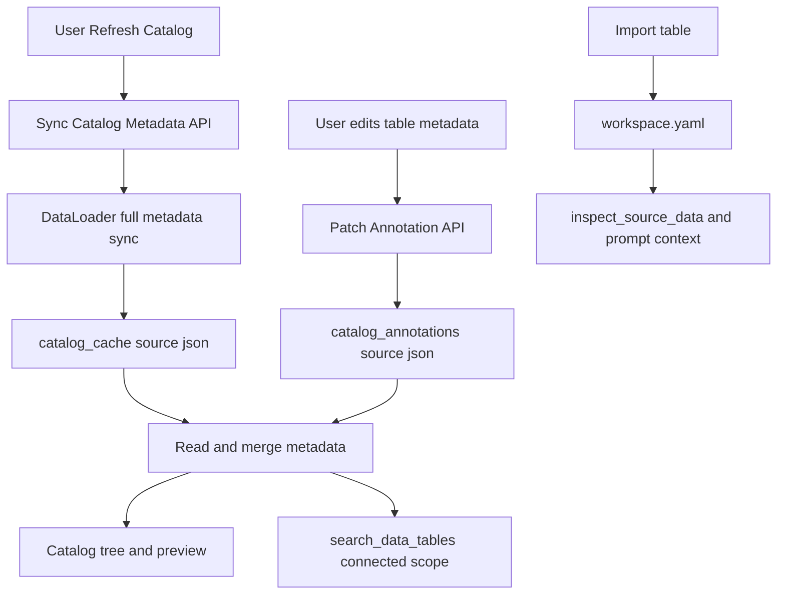
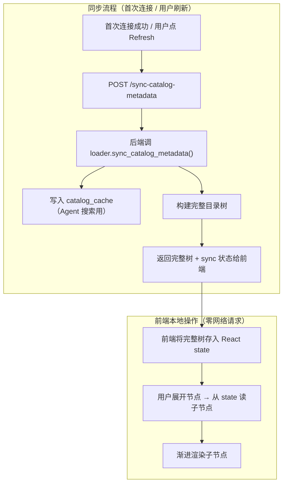

# Catalog Metadata Sync 与 Annotations 开发方案

## 目标
- 刷新数据源目录时同步完整源 metadata，尤其让 Superset 未 preview/未导入的数据集也能被 Agent 按表描述、列名、列描述搜索。
- 远端自动 metadata 写入用户级 `catalog_cache/<source_id>.json`，刷新时可覆盖。
- 用户手写 metadata 写入 `catalog_annotations/<source_id>.json`，刷新远端 catalog 时绝不覆盖。
- 前端目录、preview、Agent 搜索都消费统一的 merged metadata。

## 现有依据
- `search_data_tables` 已搜索 workspace metadata 与 catalog cache：[`py-src/data_formulator/agents/context.py`](py-src/data_formulator/agents/context.py)。
- catalog cache 搜索已经读取 `tables[].metadata.description` 和 `tables[].metadata.columns[].description`：[`py-src/data_formulator/datalake/catalog_cache.py`](py-src/data_formulator/datalake/catalog_cache.py)。
- 连接和 eager tree 已有 `save_catalog(...)` 写入点，但前端主目录刷新仍走懒加载路径：[`py-src/data_formulator/data_connector.py`](py-src/data_formulator/data_connector.py)、[`src/views/DataSourceSidebar.tsx`](src/views/DataSourceSidebar.tsx)。
- Superset dataset detail 已实现，但主要被 preview/import 使用：[`py-src/data_formulator/data_loader/superset_data_loader.py`](py-src/data_formulator/data_loader/superset_data_loader.py)。

### 现有 catalog_cache 写入路径分析

当前只有两个端点会写入 `catalog_cache`：
- `POST /api/connectors/connect`：连接成功后 best-effort 调用 `list_tables()` → `save_catalog()`
- `POST /api/connectors/get-catalog-tree`：调用 `list_tables()` 构建树 → `save_catalog()`

**前端侧边栏刷新按钮调用的是 `POST /api/connectors/get-catalog`（`ls` 懒加载），不写 `catalog_cache`**。这导致"前端看到的最新目录"和"Agent 能搜到的缓存数据"不同步——Agent 搜索的是首次连接时写入的过时数据。本方案的 sync API 就是为了补上这个 gap。

## 数据流


## 存储设计

### Identity 隔离

`catalog_cache` 和 `catalog_annotations` 按 identity 隔离存储，遵循现有 `DataConnector` 的身份隔离模型（参见 dev-guide-3 §5）：

- **User connector** 的 cache 和 annotations 存储在 `users/<identity>/catalog_cache/` 和 `users/<identity>/catalog_annotations/`。
- **Admin 预置的 global connector** 可共享 cache（存储在全局位置或每个 identity 各自维护副本）。
- 写入路径通过 `get_user_home(identity)` 获取 identity 根目录，与现有 `save_catalog()` 逻辑一致。
- 不同 identity 之间的 annotations 完全隔离，互不可见。

### catalog_cache

- `catalog_cache/<source_id>.json`
  - Owner：系统。
  - 来源：远端数据源自动同步。
  - 刷新目录时可整体覆盖。
  - 格式保持现有搜索兼容：`{ source_id, synced_at?, tables: [...] }`。
  - 每个 table：`name`, `path`, `uuid`（如可用）, `metadata.description`, `metadata.columns[]`, `metadata.source_metadata_status`。

### catalog_annotations

- `catalog_annotations/<source_id>.json`
  - Owner：用户。
  - 来源：用户手动编辑。
  - 远端刷新绝不覆盖。
  - 每个数据源一个文件，不是每张表一个文件。

### Annotation Key 策略

**核心规则：由 Loader 开发者提供 `table_key`，系统统一使用，不做类型判断。**

每个 Loader 在返回 table 记录（`list_tables()` / `sync_catalog_metadata()`）时，**必须**为每条记录提供一个 `table_key` 字段。这是该表在该数据源中的**稳定唯一标识**，由 Loader 开发者根据源系统特性自行选择最稳定的值。

Annotation 系统、搜索系统、Agent 工具**统一使用 `table_key`** 作为关联标识，无需根据数据源类型做任何分支判断。

```python
# 统一逻辑，零类型判断
annotation = annotations["tables"].get(table_entry["table_key"])
```

**Loader 开发者的职责**：

| Loader | table_key 值 | 选择原因 |
|--------|-------------|---------|
| Superset | Dataset UUID（如 `a1b2c3d4-...`） | ID 可能因导入/导出变化，UUID 永久不变 |
| PostgreSQL/MySQL/MSSQL | `_source_name`（如 `mydb.public.orders`） | 稳定，除非表被 rename |
| BigQuery | `project.dataset.table` | 同上 |
| S3/AzureBlob | 完整文件路径 | 同上 |

上表只是各 Loader 当前的选择参考。**系统层面不关心 `table_key` 的具体内容**——只要求它在同一 source 内唯一且尽可能稳定。

**对 Loader 接口的要求**：
- `list_tables()` 和 `sync_catalog_metadata()` 返回的每条 table 记录**必须包含 `table_key` 字段**。
- `table_key` 不能为空、不能包含文件系统危险字符（因为只作为 JSON key 使用，无此风险）。
- 其他辅助标识（`uuid`、`_source_name`、`dataset_id` 等）保留在 `metadata` 中备查，但 annotation/search 关联只看 `table_key`。

**Superset 额外说明**：
- 需修改 `superset_client.py` 的 `list_datasets()` 方法，在请求参数中增加 `uuid` 字段：`GET /api/v1/dataset/?q=(columns:!(id,uuid,table_name,datasource_name,database.database_name))`。
- Dashboard 也有 `uuid`，但本方案**不需要**——annotations 只关联 dataset。
- Dashboard 在 catalog tree 中仅作为组织文件夹，其标题改名不影响 annotation 关联。

**catalog_cache 中的 table 记录格式**：
```json
{
  "table_key": "a1b2c3d4-e5f6-7890-abcd-ef1234567890",
  "name": "42:monthly_orders",
  "path": ["Sales Dashboard", "monthly_orders"],
  "metadata": {
    "uuid": "a1b2c3d4-e5f6-7890-abcd-ef1234567890",
    "dataset_id": 42,
    "row_count": 15000,
    "schema": "public",
    "database": "analytics",
    "description": "Monthly order aggregation",
    "columns": [...],
    "source_metadata_status": "synced"
  }
}
```

### Annotation 文件示例

Annotation 以 `table_key` 作为字典 key：

```json
{
  "source_id": "superset_prod",
  "updated_at": "2026-04-28T10:00:00Z",
  "version": 3,
  "tables": {
    "a1b2c3d4-e5f6-7890-abcd-ef1234567890": {
      "description": "订单分析数据集",
      "notes": "用于财务与运营看板，金额字段均为税后口径。",
      "tags": ["orders", "finance"],
      "columns": {
        "order_id": { "description": "订单唯一标识" },
        "status": { "description": "订单状态" }
      }
    }
  }
}
```

PostgreSQL 示例（`table_key` = `_source_name`）：
```json
{
  "source_id": "pg_analytics",
  "updated_at": "2026-04-28T10:00:00Z",
  "version": 2,
  "tables": {
    "analytics.public.orders": {
      "description": "订单事实表",
      "columns": {
        "order_id": { "description": "订单唯一标识" }
      }
    }
  }
}
```

### source_metadata_status 枚举

| 状态值 | 含义 |
|--------|------|
| `"synced"` | 已成功同步全部 metadata（表描述 + 列信息） |
| `"partial"` | 部分 metadata 获取成功（如表描述有但列描述拉取失败） |
| `"unavailable"` | metadata 获取完全失败（如 API 超时/权限不足），仅有 list_tables 级别的基础信息 |
| `"not_synced"` | 从未执行过 full sync（仅有首次连接时的轻量 list_tables 结果） |

## Annotation 写入策略

- 新增 annotation 存储模块：[`py-src/data_formulator/datalake/catalog_annotations.py`](py-src/data_formulator/datalake/catalog_annotations.py)。
- API 不接受整文件覆盖，只接受单表 patch：`connector_id`, `table_key`（UUID 或 _source_name）, `description`, `columns`。
- 后端在文件锁内执行：读取最新文件 → merge 当前 table patch → 写临时文件 → atomic replace。

### 锁机制与乐观并发

**文件锁**：复用现有 `WorkspaceLock` 模式（[`py-src/data_formulator/datalake/workspace_metadata.py`](py-src/data_formulator/datalake/workspace_metadata.py)）：
- Windows 使用 `LockFileEx`，Unix 使用 `fcntl.flock`。
- 非阻塞尝试 + 超时重试（默认 10s）。
- 在单次锁内完成 read-modify-write，防止并发写损坏。

**乐观并发控制**（防止 lost update）：
- 客户端 PATCH 请求**必须**携带 `expected_version` 字段。
- 后端在锁内读取文件后，检查当前 `version` 是否等于 `expected_version`：
  - 匹配 → 执行 merge + 递增 version + 写入。
  - 不匹配 → 返回 `ANNOTATION_CONFLICT` 错误，携带当前 version 和冲突表的当前值。
- 前端收到 conflict 后提示用户 reload 最新数据再重试。
- 对于新建文件（无 version），`expected_version` 传 `0` 或 `null`。

### 语义约定

- 字段缺失：不修改已有值。
- `description: ""`：删除该 description 字段，而不是保留空字符串。
- 若某张表的 description、columns、notes 等用户 annotation 全部为空，则从 `tables` 中移除该表 key，避免留下无意义空对象。
- 列级 description 清空同理：删除该列的 description；如果该列 annotation 为空，则删除该列 key；如果 columns 为空，则删除 columns。

### 路径安全

遵循 [dev-guides/8-path-safety.md](dev-guides/8-path-safety.md)：
- `source_id` **不**直接使用客户端传入值——后端通过 `_resolve_connector(data)` 从已注册的 connector 中解析，相当于白名单校验。
- annotation 文件存储目录通过 `ConfinedDir` 约束。路径构造方式：`ConfinedDir(user_home / "catalog_annotations").resolve(f"{safe_source_id(source_id)}.json")`。
- `table_key` 作为 JSON 内部的字典 key，不参与文件系统路径拼接，无路径穿越风险。
- 如果未来按表拆分文件，table_key 进入文件名时必须经过 `safe_data_filename()` + `ConfinedDir.resolve()` 二次校验。

### 文件大小与分片

- 第一版保持每 source 一个文件，方便搜索和合并。
- 如果单个数据源 annotation 文件未来过大，再考虑按 schema/hash 分片。

## Annotation 内容形态
- 建议采用结构化字段为主，而不是把整张表的 metadata 都塞进一段 markdown。
- 原因：
  - Agent 搜索和人工搜索需要区分表描述、列描述、标签、业务备注等字段，便于加权排序。
  - 前端可以分别展示和编辑表级/列级说明。
  - 与远端 `catalog_cache` 的 `metadata.description`、`metadata.columns[]` 结构一致，合并逻辑更简单。
- 建议保留一个可选自由文本字段，例如 `notes`，用于用户写较长业务背景；但 `description` 和 `columns` 仍保持结构化。
- 推荐表级 annotation 结构：
```json
{
  "description": "订单分析数据集",
  "notes": "用于财务与运营看板，金额字段均为税后口径。",
  "tags": ["orders", "finance"],
  "columns": {
    "order_id": { "description": "订单唯一标识" },
    "status": { "description": "订单状态" }
  }
}
```

## Metadata 合并策略
- 读取时生成运行时 merged metadata view，不直接修改 `catalog_cache`，也不丢弃远端 source metadata。
- "用户 annotation 优先"仅用于 UI 主显示字段，不表示覆盖或删除远端描述。
- merged view 同时保留 source 与 user 两类来源，便于 Agent 和高级搜索分别加权。
- 表级合并：
  - `display_description = user.description || source.description`
  - `user_description = user.description`
  - `source_description = source.description`
- 列级合并：
  - `display_column_description = user.columns[col].description || source.columns[col].description`
  - `user_column_description = user.columns[col].description`
  - `source_column_description = source.columns[col].description`
- 搜索和 Agent 上下文可以同时使用 user 与 source 描述：
  - 用户 annotation 命中权重更高，因为它更贴近当前用户/团队语义。
  - 远端 source metadata 仍参与搜索和上下文，避免丢失数据源原始语义。
- 合并点：
  - catalog tree API 返回节点。
  - `search_catalog_cache()` 或其上层搜索工具。
  - preview metadata 展示。
- 合并时使用 annotation key（UUID 或 _source_name）关联 cache 中的 table 记录与 annotations 中的标注。

## 后端接口

### Sync Catalog Metadata API

- 新增 `POST /api/connectors/sync-catalog-metadata`
  - 触发 full metadata sync。
  - 写入 `catalog_cache`。
  - **返回完整目录树 + sync 状态摘要**，前端用此树直接渲染目录，无需再次请求。
  - 响应体：`{ status: "ok", tree: [...], sync_summary: { synced: N, partial: N, failed: N, total: N } }`

### 与现有端点的关系和改造

现有 catalog 浏览有三个端点，本方案对其定位进行调整：

| 端点 | 现有行为 | 本方案后的定位 |
|------|---------|--------------|
| `POST /get-catalog` | 调用 `loader.ls()`，实时打远端 API，不写 cache | **废弃主路径**。前端节点展开改为从本地 state 读取，不再调用此端点。保留用于 fallback 或特殊场景。 |
| `POST /get-catalog-tree` | 调用 `list_tables()` + 构建树 + 写 cache | **被 sync API 取代**。sync API 是其增强版（含完整 metadata）。可保留用于向后兼容。 |
| `POST /sync-catalog-metadata`（新） | 调用 `sync_catalog_metadata()` + 构建树 + 写 cache + 返回树 | **新主路径**。首次连接和用户刷新都用它。 |

### Annotation API

- `PATCH /api/connectors/catalog-annotations`：单表 patch。
  - 请求体：`{ connector_id, table_key, expected_version, description?, notes?, tags?, columns? }`
  - 成功响应：`{ status: "ok", version: <new_version> }`
  - 冲突响应：`{ status: "error", error: { code: "ANNOTATION_CONFLICT", message: "...", current_version: N } }`
- `GET /api/connectors/catalog-annotations?connector_id=...`：读取当前 source 的用户标注。

## 同步触发时机与前端浏览模型

### 核心设计：Sync 返回完整树，前端本地渲染



### 明确行为

- **首次连接成功** → 前端自动调用 sync API（同步等待结果，显示 loading）→ 拿到完整树后存入 state。
- **用户点"刷新 catalog"按钮** → 前端调用 sync API → 全量重新拉取 metadata → 覆盖 catalog_cache → 返回新完整树 → 前端替换 state → UI 更新。
- **用户展开目录节点** → **纯前端操作**：从 React state 中读取该节点的 children 并渲染。不发送任何后端请求。
- **Agent 不能触发 sync**（避免 Agent 操作过于侵入）。
- **不做定时自动同步**（只支持手动刷新）。

### 与当前实现的对比

| 行为 | 当前实现 | 本方案 |
|------|---------|--------|
| 首次展开 connector | 调 `get-catalog`（`ls` path=[]），实时打 Superset API | 调 sync API，全量拉取返回完整树 |
| 展开子节点 | 调 `get-catalog`（`ls` path=[...]），实时打 Superset API | 纯前端 state 读取，零网络请求 |
| 点击刷新 | 调 `get-catalog`（`ls` path=[]），只刷根级 | 调 sync API，全量刷新 + 写 cache |
| Agent 搜索数据一致性 | 不一致（cache 只在 connect 时写过一次） | 一致（每次刷新都同步 cache） |
| 节点展开速度 | 慢（每次等网络往返） | 极快（本地 state 读取） |
| 数据新鲜度 | 每次展开都是实时最新 | 以上次 sync 为准（用户主动刷新） |

### 对 BI 元数据场景的合理性

对于 Superset 等 BI 系统的 catalog 元数据（表名、列信息、描述），变化频率很低（通常以天/周为单位）。以"用户主动刷新"为数据新鲜度边界完全合理——用户看到的目录始终是上次 sync 的快照，需要最新数据时点一次刷新。

### 前端 state 管理

- sync API 返回完整树后，前端将其存入组件 state（如 `catalogCache[connectorId]`）。
- 节点展开/折叠只是 UI 状态变化，不触发数据请求。
- 进程刷新（浏览器 F5）后 state 丢失，前端需重新调用 sync API 获取树（或可考虑 sessionStorage 缓存以加速恢复）。
- 如果后续树过大需要分页，可在 sync 响应中提供 `truncated` 标志，前端仅对超大目录做按需加载（当前 Superset 规模不需要）。

### 需要修改的现有代码

| 文件 | 修改内容 |
|------|---------|
| [`py-src/data_formulator/data_connector.py`](py-src/data_formulator/data_connector.py) | 新增 `sync-catalog-metadata` 端点（复用 `get-catalog-tree` 的树构建 + 写缓存逻辑，数据源改为 `sync_catalog_metadata()`） |
| [`src/views/DataSourceSidebar.tsx`](src/views/DataSourceSidebar.tsx) | 刷新按钮和首次展开改为调 sync API；移除 `fetchCatalogNodes` 对 `get-catalog` 的调用；节点展开改为纯 state 读取；移除 `onLazyExpand` 回调中的网络请求 |
| [`src/app/utils.tsx`](src/app/utils.tsx) | 新增 `CONNECTOR_ACTION_URLS.SYNC_CATALOG_METADATA` 常量 |
| [`py-src/data_formulator/data_loader/external_data_loader.py`](py-src/data_formulator/data_loader/external_data_loader.py) | 新增基类 `sync_catalog_metadata()` 方法 |
| [`py-src/data_formulator/data_loader/superset_data_loader.py`](py-src/data_formulator/data_loader/superset_data_loader.py) | override `sync_catalog_metadata()`，并发拉 dataset detail |
| [`py-src/data_formulator/data_loader/superset_client.py`](py-src/data_formulator/data_loader/superset_client.py) | `list_datasets()` 请求参数增加 `uuid` 字段 |

### `get-catalog` / `ls()` 端点保留策略

`get-catalog` 和 `ls()` **不删除**，但从前端主浏览路径中移除：
- 保留用于：`search-catalog`（服务端搜索仍可能需要实时查询）、未来特殊场景（如超大目录按需加载）、向后兼容。
- 前端主路径改为：sync → state → 本地渲染。
- `get-catalog-tree` 被 sync API 功能覆盖，可保留但不再是主要入口。

## Loader 改动

### 接口设计

在 [`py-src/data_formulator/data_loader/external_data_loader.py`](py-src/data_formulator/data_loader/external_data_loader.py) 增加 `sync_catalog_metadata(table_filter=None)` 方法。

### table_key 契约

`list_tables()` 和 `sync_catalog_metadata()` 返回的每条 table 记录**必须包含 `table_key` 字段**：

```python
{
    "table_key": "a1b2c3d4-...",   # 必须，由 Loader 提供的稳定唯一标识
    "name": "42:monthly_orders",    # 显示名
    "path": [...],                  # 树形路径
    "metadata": { ... }             # 详情
}
```

基类可提供辅助方法或校验逻辑，确保所有 Loader 返回的记录都有合法的 `table_key`。

### 与现有接口的关系

| 方法 | 定位 | 返回内容 |
|------|------|---------|
| `list_tables(table_filter)` | 轻量 catalog（用于目录浏览） | 表名 + 基础 metadata + `table_key`（无列描述） |
| `get_metadata(path)` | 单表详细 metadata（用于 preview/详情） | 列名 + 列描述 + row_count 等 |
| `sync_catalog_metadata(table_filter)` | **全量 metadata sync**（用于 Agent 搜索缓存 + 前端完整树） | 所有表 + 尽可能完整的列信息和描述 + `table_key` |

`sync_catalog_metadata()` 不是一个与现有方法平行的新接口，而是**现有接口的组合编排**：

### 基类默认实现

```python
def sync_catalog_metadata(self, table_filter=None):
    """Full metadata sync for catalog cache.

    Default implementation: returns list_tables() results as-is.
    SQL-based loaders (PostgreSQL, MySQL, etc.) already include full column
    info from information_schema in list_tables(), so the default is sufficient.

    Override this method only when list_tables() is intentionally lightweight
    and per-table detail requires additional API calls (e.g. Superset).
    """
    return self.list_tables(table_filter)
```

### 各 Loader 是否需要 Override

| Loader | list_tables 包含列信息？ | 需要 override sync_catalog_metadata？ |
|--------|------------------------|-------------------------------------|
| MySQL | 是（information_schema 是全局的，跨库可见） | **不需要**，默认实现足够 |
| PostgreSQL | 是（从 information_schema 批量查） | **需要** override（information_schema 是单库隔离的，database 为空时需遍历所有数据库） |
| MSSQL | 是（从 INFORMATION_SCHEMA 批量查） | **需要** override（同 PostgreSQL，information_schema 单库隔离） |
| BigQuery | 是（从 dataset API 批量查） | **不需要** |
| S3/AzureBlob | 否（文件类无列描述） | **不需要**（无更多 metadata 可获取） |
| Superset | 否（只有 id/name/row_count） | **需要** override |

> **注意**：`information_schema` 单库隔离的 SQL loader（PostgreSQL、MSSQL）必须 override `sync_catalog_metadata()`，在 `database` 参数为空时遍历所有可访问数据库，逐库查询。`list_tables()` 保持只查当前连接库的行为不变。

### Superset override

```python
def sync_catalog_metadata(self, table_filter=None):
    """Enrich list_tables with per-dataset column details.

    Uses /api/v1/dataset/{pk}/column (faster than full detail endpoint).
    UUID and description already come from list_datasets() default response.
    """
    tables = self.list_tables(table_filter)
    token = self._ensure_token()

    # list_datasets 已返回 uuid 和 description，设置 table_key
    for t in tables:
        meta = t.get("metadata", {})
        ds_uuid = meta.get("uuid")
        if ds_uuid:
            t["table_key"] = ds_uuid

    # 并发获取列 metadata，使用专用 column 端点（比 full detail 快）
    with ThreadPoolExecutor(max_workers=5) as pool:
        futures = {}
        for t in tables:
            ds_id = t.get("metadata", {}).get("dataset_id")
            if ds_id:
                futures[pool.submit(
                    self._client.get_dataset_columns, token, ds_id
                )] = t

        for future in as_completed(futures, timeout=120):
            table_entry = futures[future]
            try:
                columns_raw = future.result()
                if columns_raw:
                    columns = [
                        {
                            "name": c.get("column_name", ""),
                            "type": self._normalize_column_type(c),
                            "is_dttm": bool(c.get("is_dttm")),
                            "description": (
                                c.get("verbose_name") or c.get("description") or ""
                            ).strip() or None,
                        }
                        for c in columns_raw
                    ]
                    table_entry["metadata"]["columns"] = columns
                    table_entry["metadata"]["source_metadata_status"] = "synced"
                else:
                    table_entry["metadata"]["source_metadata_status"] = "unavailable"
            except Exception:
                table_entry["metadata"]["source_metadata_status"] = "unavailable"

    return tables
```

### Superset UUID 获取

**调研结论：UUID 已在默认返回字段中，无需额外指定。**

从 Superset 6.0 源码 `datasets/api.py` 的 `DatasetRestApi.list_columns` 可以确认，`GET /api/v1/dataset/` 列表端点**默认返回** `uuid` 和 `database.uuid` 字段：

```python
# Superset 源码 datasets/api.py
list_columns = [
    "id",
    "uuid",                    # 默认返回
    "database.id",
    "database.database_name",
    "database.uuid",           # database 的 uuid 也默认返回
    "description",
    "schema",
    "table_name",
    ...
]
```

因此：
- `superset_client.py` 的 `list_datasets()` **不需要修改请求参数**，只需从响应中读取已有的 `uuid` 字段。
- Superset loader 的 `list_tables()` / `sync_catalog_metadata()` 将 `uuid` 作为 `table_key` 写入每条 table 记录。
- Dashboard UUID **不需要**获取——annotation 只关联 dataset。

### Superset 性能策略

**调研结论：没有批量列 metadata API，但有专用列端点可优化。**

| Superset 端点 | 返回内容 | 性能 |
|--------------|---------|------|
| `GET /api/v1/dataset/` | 列表（id、uuid、table_name、description 等，**不含**列定义） | 快（一次请求获取所有 dataset 基础信息） |
| `GET /api/v1/dataset/{pk}` | 完整详情（含列、metrics、owners 的笛卡尔积） | 大 dataset 可能超时 |
| `GET /api/v1/dataset/{pk}/column` | **仅列 metadata**（column_name、type、description、is_dttm 等） | 快（7000 列 ~1s） |

**推荐策略**：sync 时使用 `/api/v1/dataset/{pk}/column` 端点而非完整的 `/api/v1/dataset/{pk}`——它只返回列信息，不计算 metrics × columns × owners 的笛卡尔积，速度快得多。

```python
# superset_client.py 新增方法
def get_dataset_columns(self, access_token: str, dataset_id: int) -> list[dict]:
    """Fetch only column metadata (faster than full dataset detail)."""
    resp = requests.get(
        f"{self.base_url}/api/v1/dataset/{dataset_id}/column",
        headers=self._headers(access_token),
        timeout=self.timeout,
    )
    resp.raise_for_status()
    return resp.json().get("result", [])
```

**并发与容错**：
- 并发上限 5（`ThreadPoolExecutor(max_workers=5)`），避免压垮 Superset API。
- 全局超时 120s，超时后返回已获取的部分结果，剩余标记为 `partial`。
- 单个 dataset column 请求失败不阻断整体，标记该 dataset 为 `unavailable`。
- 表级 `description` 已从 `list_datasets()` 获得（默认返回），无需额外请求。
- 如果 dataset 数量超过 50 且同步耗时明显（后续观察决定），引入异步 job 机制。

## 连接生命周期与清理

| 操作 | catalog_cache | catalog_annotations | 原因 |
|------|--------------|--------------------|----|
| Disconnect | **保留** | **保留** | 允许离线搜索已知 metadata |
| Delete connector | **删除** | **保留** | 用户标注有独立价值，重建同名连接后可复用 |
| Reconnect（重新连接同一 source） | 首次 sync 时**覆盖** | **不变** | cache 是系统数据，新鲜覆盖；annotations 是用户数据，不动 |
| Re-sync（用户点刷新） | **覆盖** | **不变** | 同上 |

- Delete connector 时删除 cache 的实现：复用现有 `delete_catalog(user_home, source_id)`。
- Annotations 保留策略：即使 connector 被删除，annotations 文件不主动清理。如果用户创建了同名 connector，旧 annotations 自动生效。
- 如果需要"彻底清理"，可后续提供一个 admin 清理命令或 UI 入口。

## 前端改动

### 浏览模型重构

核心变化：**节点展开不再发网络请求**，完整目录树通过 sync API 一次性获取并存入前端 state。

| 现有行为 | 改为 |
|---------|------|
| `fetchCatalogNodes(connectorId)` 调 `get-catalog` | `syncCatalog(connectorId)` 调 `sync-catalog-metadata`，返回完整树 |
| `onLazyExpand` → `fetchCatalogNodes(connectorId, node.path)` | 纯 state 操作：从 `catalogCache[connectorId]` 中读取子节点 |
| `onLoadMore` → `fetchCatalogNodes(..., { append, offset })` | 不再需要（完整树已在 state），除非未来需要超大目录分页 |
| 刷新按钮 → `fetchCatalogNodes(connector.id)` | 刷新按钮 → `syncCatalog(connector.id)` |

### 具体改动清单

[`src/views/DataSourceSidebar.tsx`](src/views/DataSourceSidebar.tsx)：
- 新增 `syncCatalog(connectorId)` 函数：调用 sync API → 将返回的 `tree` 存入 `catalogCache` state → 显示 sync 状态。
- `toggleSource`（首次展开）：如果该 connector 无缓存树数据，调用 `syncCatalog`。
- 刷新按钮 `onClick`：改为调用 `syncCatalog`。
- 移除 `onLazyExpand` 中的 `fetchCatalogNodes` 调用，改为前端 state 读取。
- 移除 `onLoadMore` 的分页逻辑（完整树已加载）。
- `fetchCatalogNodes` 函数可保留但不再作为主路径使用。

### Metadata 展示

- 刷新期间显示同步状态（progress indicator）；完成后更新目录树。
- 目录节点展示 merged metadata：display description tooltip、row count、metadata status badge。
- 前端需要能查看原始数据源 metadata：
  - 表级展示 `source_description`（远端原始描述）和 `user_description`（用户标注）。
  - 列级展示 `source_column_description` 和 `user_column_description`。
  - 主显示文案使用 `display_description` / `display_column_description`，但详情面板或 tooltip 中保留来源区分。
  - 当 user 与 source 都存在且不同，UI 应能让用户看出"用户标注"和"数据源原始描述"是两份信息。
- 添加用户编辑入口时，调用 annotation patch API；保存后只更新 annotation，不改远端 cache。

## Agent 搜索影响
- `search_data_tables(scope="connected"|"all")` 可搜索未导入数据集的表描述、列名和列描述。
- `inspect_source_data` 暂不扩展为远端 inspect，仍只读取 workspace parquet。Agent 要分析真实数据仍需导入或后续加载工具。

## Agent 工具分层
- `search_data_tables` 只作为 Grep/Search 层：返回候选表、简短描述、matched columns、score、match reasons。
- 需要补一个 Read 层能力，用于在未导入数据源中读取某个候选表的完整 catalog metadata，但不读取真实数据行：
  - 推荐接口/工具名：`read_catalog_metadata` 或 `inspect_catalog_metadata`。
  - 输入：`source_id`, `table_key`（UUID 或 _source_name）。
  - 输出：merged metadata view，包括 `source_description`, `user_description`, `display_description`, columns 的 source/user/display 描述、metadata status、schema/database、row_count。
  - 不返回凭据、连接参数、内部物理路径——通过输出字段白名单控制。
- `inspect_source_data` 保持 Data/Inspect 层：只针对已导入 workspace 表读取 parquet schema、样例行、统计信息。
- 对 Agent 的使用链路：
  - 先用 `search_data_tables` 找候选。
  - 再用 `read_catalog_metadata` 展开未导入候选的完整字段语义。
  - 如果需要真实样例行或计算分析，再引导导入或走后续数据加载工具。
- 对人工搜索 UI：
  - 搜索结果列表使用 `search_data_tables` / catalog search。
  - 详情侧栏使用同一个 read metadata API，展示 source 与 user 两类描述。

## 错误码与 i18n

### 错误码定义

遵循 [dev-guides/7-unified-error-handling.md](dev-guides/7-unified-error-handling.md)，新增 API 使用 `AppError` + `ErrorCode`：

| 错误码 | 触发场景 | HTTP | retry |
|--------|---------|------|-------|
| `CATALOG_SYNC_TIMEOUT` | sync_catalog_metadata 整体超时（>120s） | 200 | true |
| `CATALOG_SYNC_PARTIAL` | sync 部分成功（某些 dataset detail 失败） | 200（status: "ok"，附带 warnings） | false |
| `ANNOTATION_CONFLICT` | PATCH annotation 时 version 不匹配 | 200 | false（用户需 reload） |
| `ANNOTATION_INVALID_PATCH` | PATCH 请求体格式错误 | 200 | false |
| `CATALOG_NOT_FOUND` | 请求的 connector_id 不存在或未连接 | 200 | false |

### 前端 i18n

新增 UI 字符串使用 `dataLoading` namespace：
- sync 状态文案：`dataLoading.syncInProgress`, `dataLoading.syncComplete`, `dataLoading.syncPartial`
- annotation 编辑器：`dataLoading.annotationSaved`, `dataLoading.annotationConflict`
- metadata status badge：`dataLoading.metadataStatusSynced`, `dataLoading.metadataStatusPartial`, `dataLoading.metadataStatusUnavailable`, `dataLoading.metadataStatusNotSynced`

所有新增字符串必须同时添加 `en` 和 `zh` 两个 locale 文件。

### 后端 message_code

后端返回的用户可见消息附带 `message_code`，前端使用 `translateBackend()` 翻译：
- `catalog_sync_timeout`
- `annotation_conflict`
- `annotation_saved`

## 后续设计 TODO（不在本轮）
- 远端数据内容读取工具：
  - Agent 现在只能读取已导入 workspace 表的内容；未导入 connected 表本轮只支持搜索 metadata 和读取 catalog metadata。
  - 后续需要设计 `preview_remote_table` / `read_remote_sample` 类工具，用于基于搜索结果读取远端表样例行、schema 和统计信息。
  - 该工具必须有行数限制、权限校验、超时、审计日志和脱敏策略，不能变成任意远端查询入口。
- Agent 自动导入工具：
  - 后续需要让 Agent 在搜索命中后，根据用户目标选择合适数据集并调用受控 import，将远端表加载到 workspace。
  - 需要明确用户确认机制、默认行数上限、source filters、命名策略和重复导入处理。
- 人工搜索/选表体验：
  - 后续在前端提供搜索结果详情、远端预览、加入 workspace 的完整流程。
  - 本轮只完成 metadata 搜索与 catalog metadata read，为该体验提供基础。
- 高级搜索引擎：
  - 本轮只做 DuckDB Grep/Search 底座。
  - 后续再设计 DuckDB FTS、fuzzy match、query parser、embedding/semantic search、物化索引等能力。

## DuckDB 搜索底座
- 本轮范围：一起实现可用的 Grep/Search 基础能力；不做完整全文搜索引擎、向量检索或复杂查询语言。
- 保持 `catalog_cache` 搜索优先 DuckDB，失败回退 Python；同时让两条路径的结果结构和评分规则保持一致。
- 本轮交付：
  - 后端统一搜索函数，面向 workspace + connected catalog cache。
  - Agent 工具 `search_data_tables` 使用结构化搜索结果后再格式化为 LLM 可读文本。
  - 预留/提供前端人工搜索可复用的结构化结果接口，避免只返回文本摘要。
  - 搜索结果包含 `source_id`, `table_key`, `table_path`, `name`, `display_description`, `matched_columns`, `score`, `match_reasons`, `metadata_status`, `status`。
- 搜索范围：
  - 已导入 workspace 表：继续使用 `WorkspaceMetadata.search_tables()`，后续可统一迁到 DuckDB 搜索层。
  - 未导入 connected 表：读取 `catalog_cache`，叠加 `catalog_annotations` 后搜索。
  - 默认不实时访问远端数据源，避免搜索触发慢连接。
- 建议统一 searchable fields：
  - `table_name`
  - `table_description`
  - `column_name`
  - `column_description`
  - `schema`, `database`, `source_id`
  - 可选 `tags` / `keywords`，先预留字段，不强依赖。
- 第一版权重建议：
  - 表名精确/子串命中最高。
  - 用户表描述命中高于远端表描述命中。
  - 列名命中高于列描述命中。
  - 用户列描述命中高于远端列描述命中。
  - 已导入 workspace 表在 `scope="all"` 下可优先于未导入 connected 表。
- token 匹配策略：
  - 英文/数字按空格、下划线、点号、斜杠、大小写边界做简单 token 化。
  - 保留整串子串匹配，避免中文场景因没有分词而失效。
  - 中文第一版继续用子串匹配；后续再评估 jieba 或 DuckDB FTS 扩展。
- annotation overlay 策略：
  - 搜索前或候选阶段合并 `catalog_cache` 与 `catalog_annotations`。
  - 第一版可采用 DuckDB 搜 cache 得候选，再用 Python overlay annotation 并重新计算/补充分数。
  - 如需要 annotation-only 命中，Python fallback/overlay 需要覆盖 annotation 描述和列描述；后续可优化成 DuckDB 联合读取两个 JSON。
- 搜索结果建议增加可解释字段，方便 Agent 和人工搜索 UI 使用：
  - `score`
  - `match_reasons`
  - `matched_columns`
  - `metadata_status`
  - `source_id`
  - `status`: imported / not imported
- 后续阶段预留：
  - DuckDB FTS / 倒排索引。
  - fuzzy match / typo tolerance。
  - query parser，例如 `source:superset status:orders column:region`。
  - embedding/semantic search。
  - 搜索索引物化表，避免每次读 JSON。

## 异步策略
- 第一版同步执行 full sync，但做逐表 best-effort 和前端 loading indicator。
- Superset 并发上限 5、全局超时 120s。
- 若 Superset 数据集多导致耗时明显（观察到用户等待体验差），再引入异步 job：`POST` 返回 `job_id`，`GET status` 轮询进度，完成后刷新树。
- 远端请求限制并发，避免压垮 Superset。

## 测试计划
- `catalog_annotations`：单表 patch merge、清空描述、并发/锁、原子写、损坏文件降级、version 冲突检测。
- `catalog_cache`：full metadata 写入后可被 `search_catalog_cache` 搜到；UUID 字段正确记录。
- DuckDB 搜索底座：字段权重、token 匹配、annotation overlay、Python fallback 一致性、`match_reasons` 输出。
- Superset：dataset UUID 获取、去重、detail 失败降级、并发限制、cache 格式正确。
- API：sync catalog 写 cache；annotation patch 不覆盖 cache；disconnect 保留 cache/annotations；delete connector 删除 cache 保留 annotations。
- 连接生命周期：首次连接自动触发 async sync；disconnect 保留；delete 清理；reconnect 覆盖。
- 前端手测/测试：刷新后未 preview 的 Superset dataset 可见描述，并能被 Agent 搜索命中。
