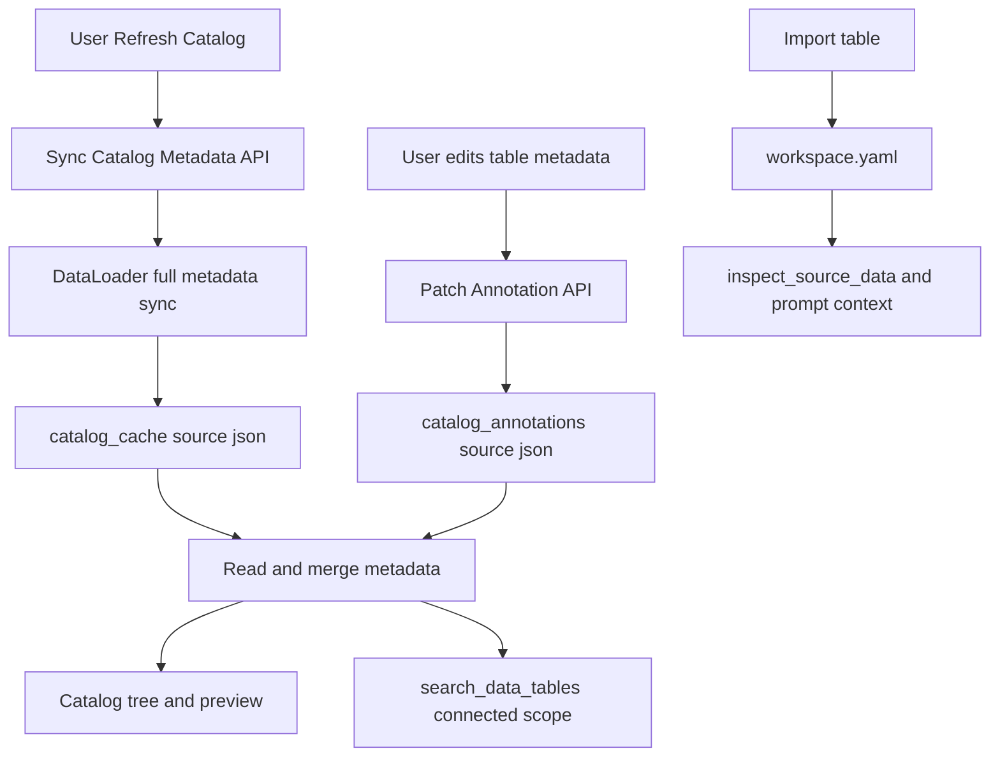

# Catalog Metadata Sync 与 Annotations 开发方案

## 目标
- 刷新数据源目录时同步完整源 metadata，尤其让 Superset 未 preview/未导入的数据集也能被 Agent 按表描述、列名、列描述搜索。
- 远端自动 metadata 写入用户级 `catalog_cache/<source_id>.json`，刷新时可覆盖。
- 用户手写 metadata 写入 `catalog_annotations/<source_id>.json`，刷新远端 catalog 时绝不覆盖。
- 前端目录、preview、Agent 搜索都消费统一的 merged metadata。

## 现有依据
- `search_data_tables` 已搜索 workspace metadata 与 catalog cache：[`py-src/data_formulator/agents/context.py`](py-src/data_formulator/agents/context.py)。
- catalog cache 搜索已经读取 `tables[].metadata.description` 和 `tables[].metadata.columns[].description`：[`py-src/data_formulator/datalake/catalog_cache.py`](py-src/data_formulator/datalake/catalog_cache.py)。
- 连接和 eager tree 已有 `save_catalog(...)` 写入点，但前端主目录刷新仍走懒加载路径：[`py-src/data_formulator/data_connector.py`](py-src/data_formulator/data_connector.py)、[`src/views/DataSourceSidebar.tsx`](src/views/DataSourceSidebar.tsx)。
- Superset dataset detail 已实现，但主要被 preview/import 使用：[`py-src/data_formulator/data_loader/superset_data_loader.py`](py-src/data_formulator/data_loader/superset_data_loader.py)。

## 数据流


## 存储设计
- `catalog_cache/<source_id>.json`
  - Owner：系统。
  - 来源：远端数据源自动同步。
  - 刷新目录时可整体覆盖。
  - 格式保持现有搜索兼容：`{ source_id, synced_at?, tables: [...] }`。
  - 每个 table：`name`, `path`, `metadata.description`, `metadata.columns[]`, `metadata.source_metadata_status`。
- `catalog_annotations/<source_id>.json`
  - Owner：用户。
  - 来源：用户手动编辑。
  - 远端刷新绝不覆盖。
  - 每个数据源一个文件，不是每张表一个文件。
  - 以 `table_path.join('/')` 作为 key。

示例：
```json
{
  "source_id": "superset_prod",
  "updated_at": "2026-04-28T10:00:00Z",
  "version": 3,
  "tables": {
    "42": {
      "description": "订单分析数据集",
      "columns": {
        "order_id": { "description": "订单唯一标识" },
        "status": { "description": "订单状态" }
      }
    }
  }
}
```

## Annotation 写入策略
- 新增 annotation 存储模块，例如 [`py-src/data_formulator/datalake/catalog_annotations.py`](py-src/data_formulator/datalake/catalog_annotations.py)。
- API 不接受整文件覆盖，只接受单表 patch：`connector_id`, `table_path`, `description`, `columns`。
- 后端在文件锁内执行：读取最新文件 → merge 当前 table patch → 写临时文件 → atomic replace。
- 语义约定：
  - 字段缺失：不修改已有值。
  - `description: ""`：删除该 description 字段，而不是保留空字符串。
  - 若某张表的 description、columns、notes 等用户 annotation 全部为空，则从 `tables` 中移除该表 key，避免留下无意义空对象。
  - 列级 description 清空同理：删除该列的 description；如果该列 annotation 为空，则删除该列 key；如果 columns 为空，则删除 columns。
  - 可选 `version` / `updated_at`：第一版记录版本；后续可用于乐观并发冲突提示。
- 如果单个数据源 annotation 文件未来过大，再考虑按 schema/hash 分片；第一版保持每 source 一个文件，方便搜索和合并。

## Annotation 内容形态
- 建议采用结构化字段为主，而不是把整张表的 metadata 都塞进一段 markdown。
- 原因：
  - Agent 搜索和人工搜索需要区分表描述、列描述、标签、业务备注等字段，便于加权排序。
  - 前端可以分别展示和编辑表级/列级说明。
  - 与远端 `catalog_cache` 的 `metadata.description`、`metadata.columns[]` 结构一致，合并逻辑更简单。
- 建议保留一个可选自由文本字段，例如 `notes`，用于用户写较长业务背景；但 `description` 和 `columns` 仍保持结构化。
- 推荐表级 annotation 结构：
```json
{
  "description": "订单分析数据集",
  "notes": "用于财务与运营看板，金额字段均为税后口径。",
  "tags": ["orders", "finance"],
  "columns": {
    "order_id": { "description": "订单唯一标识" },
    "status": { "description": "订单状态" }
  }
}
```

## Metadata 合并策略
- 读取时生成运行时 merged metadata view，不直接修改 `catalog_cache`，也不丢弃远端 source metadata。
- “用户 annotation 优先”仅用于 UI 主显示字段，不表示覆盖或删除远端描述。
- merged view 同时保留 source 与 user 两类来源，便于 Agent 和高级搜索分别加权。
- 表级合并：
  - `display_description = user.description || source.description`
  - `user_description = user.description`
  - `source_description = source.description`
- 列级合并：
  - `display_column_description = user.columns[col].description || source.columns[col].description`
  - `user_column_description = user.columns[col].description`
  - `source_column_description = source.columns[col].description`
- 搜索和 Agent 上下文可以同时使用 user 与 source 描述：
  - 用户 annotation 命中权重更高，因为它更贴近当前用户/团队语义。
  - 远端 source metadata 仍参与搜索和上下文，避免丢失数据源原始语义。
- 合并点：
  - catalog tree API 返回节点。
  - `search_catalog_cache()` 或其上层搜索工具。
  - preview metadata 展示。

## 后端接口
- 新增 `POST /api/connectors/sync-catalog-metadata`
  - 触发 full metadata sync。
  - 写入 `catalog_cache`。
  - 返回 tree/tables 或 sync 状态。
- 新增 annotation API：
  - `PATCH /api/connectors/catalog-annotations`：单表 patch。
  - `GET /api/connectors/catalog-annotations?connector_id=...`：读取当前 source 的用户标注。
- 保持 `get-catalog` 的懒加载语义，不在普通展开目录时强制全量拉远端 metadata。

## Loader 改动
- 在 [`py-src/data_formulator/data_loader/external_data_loader.py`](py-src/data_formulator/data_loader/external_data_loader.py) 增加可选 full metadata sync 方法，例如 `list_tables_with_metadata(table_filter=None)` 或 `sync_catalog_metadata(table_filter=None)`。
- 默认实现回退到 `list_tables()`，保持现有 loader 兼容。
- Superset override：
  - 枚举 dashboards 和 all datasets。
  - 按 `dataset_id` 去重。
  - 调 `get_dataset_detail` 获取表描述和列描述。
  - 单个 detail 失败不阻断整体，写入 `source_metadata_status: "partial" | "unavailable"`。

## 前端改动
- [`src/views/DataSourceSidebar.tsx`](src/views/DataSourceSidebar.tsx) 的刷新按钮调用 full sync API。
- 刷新期间显示同步状态；完成后更新目录树。
- 目录节点展示 merged metadata：display description tooltip、row count、metadata status。
- 前端需要能查看原始数据源 metadata：
  - 表级展示 `source_description`（远端原始描述）和 `user_description`（用户标注）。
  - 列级展示 `source_column_description` 和 `user_column_description`。
  - 主显示文案使用 `display_description` / `display_column_description`，但详情面板或 tooltip 中保留来源区分。
  - 当 user 与 source 都存在且不同，UI 应能让用户看出“用户标注”和“数据源原始描述”是两份信息。
- 添加用户编辑入口时，调用 annotation patch API；保存后只更新 annotation，不改远端 cache。

## Agent 搜索影响
- `search_data_tables(scope="connected"|"all")` 可搜索未导入数据集的表描述、列名和列描述。
- `inspect_source_data` 暂不扩展为远端 inspect，仍只读取 workspace parquet。Agent 要分析真实数据仍需导入或后续加载工具。

## Agent 工具分层
- `search_data_tables` 只作为 Grep/Search 层：返回候选表、简短描述、matched columns、score、match reasons。
- 需要补一个 Read 层能力，用于在未导入数据源中读取某个候选表的完整 catalog metadata，但不读取真实数据行：
  - 推荐接口/工具名：`read_catalog_metadata` 或 `inspect_catalog_metadata`。
  - 输入：`source_id`, `table_path` 或稳定 `table_key`。
  - 输出：merged metadata view，包括 `source_description`, `user_description`, `display_description`, columns 的 source/user/display 描述、metadata status、schema/database、row_count。
  - 不返回凭据、连接参数、内部物理路径。
- `inspect_source_data` 保持 Data/Inspect 层：只针对已导入 workspace 表读取 parquet schema、样例行、统计信息。
- 对 Agent 的使用链路：
  - 先用 `search_data_tables` 找候选。
  - 再用 `read_catalog_metadata` 展开未导入候选的完整字段语义。
  - 如果需要真实样例行或计算分析，再引导导入或走后续数据加载工具。
- 对人工搜索 UI：
  - 搜索结果列表使用 `search_data_tables` / catalog search。
  - 详情侧栏使用同一个 read metadata API，展示 source 与 user 两类描述。

## 后续设计 TODO（不在本轮）
- 远端数据内容读取工具：
  - Agent 现在只能读取已导入 workspace 表的内容；未导入 connected 表本轮只支持搜索 metadata 和读取 catalog metadata。
  - 后续需要设计 `preview_remote_table` / `read_remote_sample` 类工具，用于基于搜索结果读取远端表样例行、schema 和统计信息。
  - 该工具必须有行数限制、权限校验、超时、审计日志和脱敏策略，不能变成任意远端查询入口。
- Agent 自动导入工具：
  - 后续需要让 Agent 在搜索命中后，根据用户目标选择合适数据集并调用受控 import，将远端表加载到 workspace。
  - 需要明确用户确认机制、默认行数上限、source filters、命名策略和重复导入处理。
- 人工搜索/选表体验：
  - 后续在前端提供搜索结果详情、远端预览、加入 workspace 的完整流程。
  - 本轮只完成 metadata 搜索与 catalog metadata read，为该体验提供基础。
- 高级搜索引擎：
  - 本轮只做 DuckDB Grep/Search 底座。
  - 后续再设计 DuckDB FTS、fuzzy match、query parser、embedding/semantic search、物化索引等能力。

## DuckDB 搜索底座
- 本轮范围：一起实现可用的 Grep/Search 基础能力；不做完整全文搜索引擎、向量检索或复杂查询语言。
- 保持 `catalog_cache` 搜索优先 DuckDB，失败回退 Python；同时让两条路径的结果结构和评分规则保持一致。
- 本轮交付：
  - 后端统一搜索函数，面向 workspace + connected catalog cache。
  - Agent 工具 `search_data_tables` 使用结构化搜索结果后再格式化为 LLM 可读文本。
  - 预留/提供前端人工搜索可复用的结构化结果接口，避免只返回文本摘要。
  - 搜索结果包含 `source_id`, `table_key`, `table_path`, `name`, `display_description`, `matched_columns`, `score`, `match_reasons`, `metadata_status`, `status`。
- 搜索范围：
  - 已导入 workspace 表：继续使用 `WorkspaceMetadata.search_tables()`，后续可统一迁到 DuckDB 搜索层。
  - 未导入 connected 表：读取 `catalog_cache`，叠加 `catalog_annotations` 后搜索。
  - 默认不实时访问远端数据源，避免搜索触发慢连接。
- 建议统一 searchable fields：
  - `table_name`
  - `table_description`
  - `column_name`
  - `column_description`
  - `schema`, `database`, `source_id`
  - 可选 `tags` / `keywords`，先预留字段，不强依赖。
- 第一版权重建议：
  - 表名精确/子串命中最高。
  - 用户表描述命中高于远端表描述命中。
  - 列名命中高于列描述命中。
  - 用户列描述命中高于远端列描述命中。
  - 已导入 workspace 表在 `scope="all"` 下可优先于未导入 connected 表。
- token 匹配策略：
  - 英文/数字按空格、下划线、点号、斜杠、大小写边界做简单 token 化。
  - 保留整串子串匹配，避免中文场景因没有分词而失效。
  - 中文第一版继续用子串匹配；后续再评估 jieba 或 DuckDB FTS 扩展。
- annotation overlay 策略：
  - 搜索前或候选阶段合并 `catalog_cache` 与 `catalog_annotations`。
  - 第一版可采用 DuckDB 搜 cache 得候选，再用 Python overlay annotation 并重新计算/补充分数。
  - 如需要 annotation-only 命中，Python fallback/overlay 需要覆盖 annotation 描述和列描述；后续可优化成 DuckDB 联合读取两个 JSON。
- 搜索结果建议增加可解释字段，方便 Agent 和人工搜索 UI 使用：
  - `score`
  - `match_reasons`
  - `matched_columns`
  - `metadata_status`
  - `source_id`
  - `status`: imported / not imported
- 后续阶段预留：
  - DuckDB FTS / 倒排索引。
  - fuzzy match / typo tolerance。
  - query parser，例如 `source:superset status:orders column:region`。
  - embedding/semantic search。
  - 搜索索引物化表，避免每次读 JSON。

## 异步策略
- 第一版可先同步 full sync，但做逐表 best-effort 和前端 loading。
- 若 Superset 数据集多导致耗时明显，再引入异步 job：`POST` 返回 `job_id`，`GET status` 轮询进度，完成后刷新树。
- 远端请求限制并发，避免压垮 Superset。

## 测试计划
- `catalog_annotations`：单表 patch merge、清空描述、并发/锁、原子写、损坏文件降级。
- `catalog_cache`：full metadata 写入后可被 `search_catalog_cache` 搜到。
- DuckDB 搜索底座：字段权重、token 匹配、annotation overlay、Python fallback 一致性、`match_reasons` 输出。
- Superset：dataset 去重、detail 失败降级、cache 格式正确。
- API：sync catalog 写 cache；annotation patch 不覆盖 cache；disconnect/delete 清理 cache，保留或按设计清理 annotations。
- 前端手测/测试：刷新后未 preview 的 Superset dataset 可见描述，并能被 Agent 搜索命中。