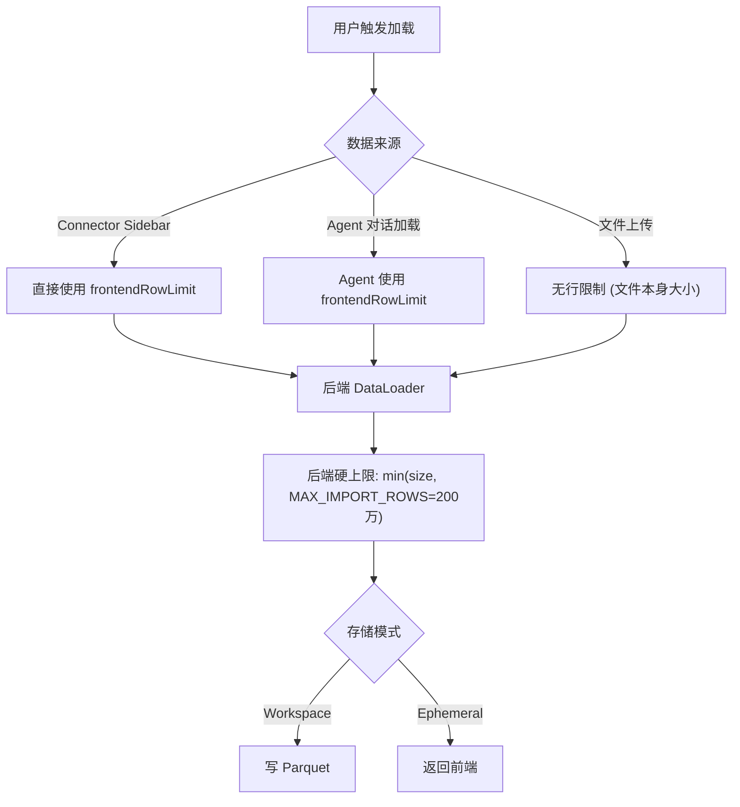

# 13 — 统一行数限制

> **Scope**: 数据加载行数限制的架构设计、两种存储模式下的行为差异、前后端限制协同。
> **最后更新**: 2026-05-05

---

## 1. 设计目标

- **唯一用户入口**: Settings 对话框的 `frontendRowLimit` 是用户控制行数的唯一设置
- **后端兜底**: `MAX_IMPORT_ROWS = 2_000_000` 硬上限，防止异常请求
- **两种模式统一**: Workspace 和 Ephemeral 模式使用相同的限制语义

---

## 2. 两种存储模式


- **Workspace 模式** (`WORKSPACE_BACKEND = 'local'` 或 `'azure_blob'`): 数据持久化在服务端 parquet 文件中，前端只保留 sample。Agent 运算在后端完成。
- **Ephemeral 模式** (`WORKSPACE_BACKEND = 'ephemeral'`): 服务端无状态，数据全部存在浏览器 IndexedDB 中。用于演示/匿名部署。

---

## 3. 限制常量一览

| 常量 | 值 | 位置 | 说明 |
|------|---|------|------|
| `MAX_IMPORT_ROWS` | 2,000,000 | `py-src/data_formulator/data_loader/external_data_loader.py` | 后端硬上限，所有 DataLoader 强制执行 |
| `DEFAULT_ROW_LIMIT` | 2,000,000 | `src/app/dfSlice.tsx` | 前端默认值（Workspace 模式） |
| `DEFAULT_ROW_LIMIT_EPHEMERAL` | 20,000 | `src/app/dfSlice.tsx` | 前端默认值（Ephemeral 模式，浏览器性能保守策略） |
| `max_display_rows` | 10,000 | `py-src/data_formulator/app.py` CLI 参数 | Agent 执行结果返回前端的**展示**行数上限，不限制存储 |

---

## 4. 数据流



### 4.1 Connector Sidebar / DBTableManager 加载

1. 前端 `tableThunks.ts` 中 `loadTable` thunk 统一注入 `import_options.size = frontendRowLimit`
2. 后端 DataLoader 的 `fetch_data_as_arrow()` 执行 `size = min(opts.get("size", MAX_IMPORT_ROWS), MAX_IMPORT_ROWS)`
3. 数据写入 Workspace 或返回前端（取决于模式）

### 4.2 Agent 对话加载

1. 前端 `DataLoadingChat.tsx` 在请求体中传入 `row_limit: frontendRowLimit`
2. 后端 `DataLoadingAgent.__init__` 接收 `row_limit` 参数
3. Agent 规划 `propose_load_plan` 时，默认使用 `self.row_limit`
4. 前端确认 load plan 后，通过 `loadTable` thunk 执行（同样注入 `frontendRowLimit`）

### 4.3 文件上传

文件上传不受 `frontendRowLimit` 限制。文件全量存入 Workspace parquet。在 Ephemeral 模式下，`frontendRowLimit` 对前端本地持有的行数进行截断。

---

## 5. 前端 Settings 对话框

- 路径: `src/app/App.tsx` → Settings Dialog
- 输入范围: `[100, 2_000_000]`
- 默认值:
  - Workspace 模式: 2,000,000
  - Ephemeral 模式: 自动降为 20,000（在 `setServerConfig` reducer 中处理）
- 用户修改后立即生效，后续所有数据加载使用新值

---

## 6. 后端硬上限

每个 DataLoader 的 `fetch_data_as_arrow()` 方法中：

```python
from data_formulator.data_loader.external_data_loader import MAX_IMPORT_ROWS

opts = import_options or {}
size = min(opts.get("size", MAX_IMPORT_ROWS), MAX_IMPORT_ROWS)
```

即使前端传入超过 200 万的 size，后端也会截断。这是安全兜底，防止异常请求导致 OOM。

---

## 7. 新 Loader 开发注意

实现 `fetch_data_as_arrow()` 时必须：

1. 从 `external_data_loader` 导入 `MAX_IMPORT_ROWS`
2. 使用 `size = min(opts.get("size", MAX_IMPORT_ROWS), MAX_IMPORT_ROWS)` 解析 size
3. 在 SQL/API 查询中使用该 size 作为 LIMIT

```python
from data_formulator.data_loader.external_data_loader import (
    ExternalDataLoader, CatalogNode, MAX_IMPORT_ROWS,
)

class MyDataLoader(ExternalDataLoader):
    def fetch_data_as_arrow(self, source_table, import_options=None):
        opts = import_options or {}
        size = min(opts.get("size", MAX_IMPORT_ROWS), MAX_IMPORT_ROWS)
        # ... use size in your query
```

---

## 8. `max_display_rows` 与行数限制的区别

| | `frontendRowLimit` / `MAX_IMPORT_ROWS` | `max_display_rows` |
|---|---|---|
| 控制什么 | 从数据源拉取并存储的最大行数 | Agent 执行结果返回前端**展示**的行数 |
| 何时生效 | 数据导入时 | Agent 代码执行后返回结果时 |
| 数据是否保留 | 是（全量存 Workspace） | 是（全量在 Workspace，只是前端展示截断） |
| 默认值 | 2,000,000 | 10,000 |
| 用户可配 | Settings 对话框 | CLI `--max-display-rows` 参数 |
