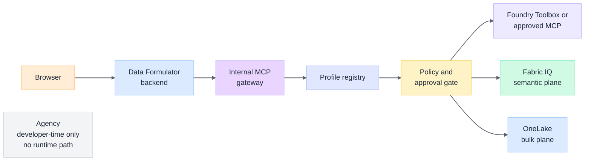
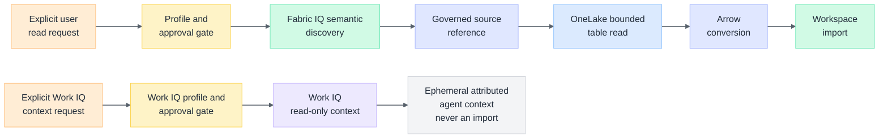
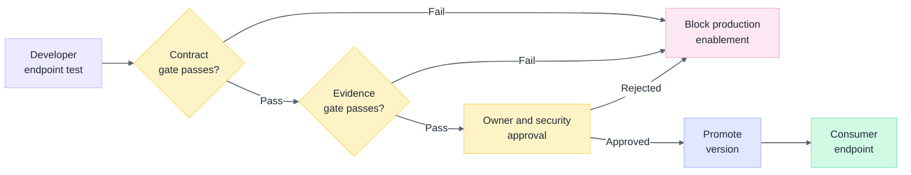

# Governed MCP Adapter Implementation Plan

**Goal:** Add a versioned, internal MCP gateway and backend-only adapter so Data Formulator can use approved enterprise intelligence and data capabilities without exposing arbitrary MCP tools, Microsoft 365 content, or credentials to the browser or model prompt.

**Architecture:** Keep `ExternalDataLoader` and `DataConnector` as the canonical tabular-data boundary. Deploy a separate internal MCP gateway with its own managed identity and a narrowly allowlisted profile registry; Data Formulator is its only initial caller. The gateway consumes a specific Foundry Toolbox or approved remote server profile. Use Fabric IQ for semantic discovery and governed natural-language answers, Work IQ only for explicit read-only workplace-context requests, and OneLake table APIs or a governed data handle for bounded table import. Agency remains a developer-time inventory, policy, and conformance-test tool; the deployed application never shells out to Agency.

**Tech Stack:** Python/Flask, Arrow/PyArrow, Data Formulator `ExternalDataLoader` and `DataConnector`, Microsoft Entra ID, Microsoft Foundry Toolboxes and MCP endpoint, Work IQ MCP, Fabric IQ, OneLake table APIs, pytest, Vitest, Bicep/azd.

---

## Decision Record

### Selected Boundary

The adapter is a product-owned MCP client behind a new `mcp_governed` loader type. It calls a separate internal MCP gateway; neither component is a generic “connect any MCP server” feature. Administrators register a finite set of versioned server profiles. Each profile declares an endpoint, a server identity, an Entra authentication audience, a capability manifest, a tool allowlist, limits, and a source class.

The first release exposes only read operations. It has three explicit lanes:

| Lane | Initial product use | Explicit exclusion |
| --- | --- | --- |
| Fabric IQ | Semantic entity discovery and bounded, provenance-bearing answers for a configured ontology or Fabric data agent | Importing bulk table data from chat-style JSON responses |
| OneLake | Table/schema metadata through the OneLake table API plus bounded import through a separately validated DFS/Delta, SQL, or governed-handle path | Using a user-delegated SAS as a browser-visible or persisted credential |
| Work IQ | User-requested, read-only workplace context such as a named document, meeting, or people lookup | Default context injection, broad mailbox/files crawling, and all mutation tools |

Azure SQL does not enter the first MCP slice. The Azure SQL capability currently reachable through Agency is management-plane only and exposes no table, schema, or query operation. The credential-based `mssql` connector remains independent. The retired delegated Azure SQL MFA flow is not replaced by this adapter.

### What Is Not Being Built

- A browser MCP client.
- A model-selected arbitrary server URL, tool name, resource path, or OAuth scope.
- A direct invocation of `agency`, `workiq`, Fabric CLI tools, or VS Code MCP proxies from the deployed Container App.
- A generic Graph or Microsoft 365 data loader.
- Any create, update, delete, action, or send operation through Work IQ.
- A Fabric IQ production dependency before preview, data-boundary, and residency review gates pass.

## Architecture Diagrams

**Figure 1:** *The public application calls a separate internal gateway, which consumes only approved profiles and backend-controlled capabilities. Agency stays outside the deployed runtime.*

**Figure 2:** *Semantic discovery selects a governed physical source; OneLake supplies bounded table data for Arrow import. Work IQ context remains separate and ephemeral.*

**Figure 3:** *A Toolbox or remote MCP profile reaches the consumer endpoint only after contract tests, live evidence, and owner/security approval.*

## Documentation Review

The plan was reviewed against the following first-party documentation on 2026-07-14.

| Source | Confirmed constraint | Plan response |
| --- | --- | --- |
| [Foundry Toolboxes](https://learn.microsoft.com/azure/foundry/agents/how-to/tools/toolbox) | Toolboxes expose a versioned MCP endpoint; `require_approval` is metadata and enforcement belongs to the client runtime | Pin a developer endpoint for test and a consumer endpoint only after promotion. Enforce approval in the adapter before every `tools/call`; never rely on Toolbox metadata as enforcement |
| [Foundry MCP tools](https://learn.microsoft.com/azure/foundry/agents/how-to/tools/model-context-protocol) | Remote MCP endpoints require explicit authentication and can be public or private | Profile registry stores allowed endpoint origin, transport, server identity, and Entra audience. Private endpoints require a separately approved networking design |
| [Work IQ MCP overview](https://learn.microsoft.com/microsoft-365/copilot/extensibility/work-iq/mcp/overview) | Work IQ uses generic read and mutation tools against resource paths, with Entra authentication and tenant policy | Initial allowlist permits only reviewed `get_schema`, `search_paths`, and `fetch` paths; mutation tools and `ask` are disabled until a source-specific policy review |
| [Work IQ policy governance](https://learn.microsoft.com/microsoft-365/copilot/extensibility/work-iq/mcp/policy-governance-mcp) | Tenant policy can deny a request even when authentication and OAuth are valid; mutation is denied by default | Classify policy denial as non-retryable and surface a sanitized governance message. Product policy remains stricter than tenant policy |
| [Fabric IQ with Foundry](https://learn.microsoft.com/azure/foundry/agents/how-to/tools/fabric-iq) | Fabric IQ is preview, can take longer than synchronous tool limits, and can have cost/compliance-boundary implications | Fabric IQ is an opt-in pilot only. Use background execution for approved long-running queries, no automatic production rollout, and record data-residency review before live use |
| [Fabric IQ ontology MCP](https://learn.microsoft.com/microsoft-copilot-studio/mcp-fabric-iq-ontology-work-iq) | The preview server exposes ontology entity discovery and natural-language query results; tool names and parameters can change | Capability manifest pins required operations and rejects drift. Treat JSON results as bounded semantic answers, not as a stable table-import protocol |
| [OneLake table APIs](https://learn.microsoft.com/fabric/onelake/table-apis/table-apis-overview) | OneLake exposes standards-compatible table APIs with Entra authentication; current Delta documentation covers read-only schema and table metadata | Use the table API for catalog/schema only. Select and validate a separate bounded DFS/Delta, SQL, or governed-handle path before converting rows to Arrow |
| [OneLake access API](https://learn.microsoft.com/fabric/onelake/onelake-access-api#authorization) | Direct OneLake requests use a Storage-audience Entra token and regional endpoint selection affects residency | Token acquisition is backend-only, audience-qualified, and region-aware. No token is returned to UI, logs, MCP tools, or prompts |

**Review conclusion:** The proposed split is consistent with current documentation, with two explicit constraints: the internal gateway pilot is feasible in the existing Container Apps environment, but private Foundry-to-gateway connectivity requires a dedicated MCP subnet; and OneLake table APIs are metadata-only, so bulk import needs a separate validated data path. The plan would be invalidated if Fabric IQ publishes a stable Arrow/table-result contract that eliminates the OneLake bulk-data lane, or if Work IQ provides a documented read-only, source-scoped profile sufficient for product connectors without broad `WorkIQAgent.Ask` consent.

## Preconditions And Ownership

Before implementation begins, record these named approvals in the issue or a decision update:

1. A Foundry project owner who can create a dedicated Toolbox and project connections.
2. A Fabric workspace owner who can provide one non-sensitive ontology/data-agent fixture and one OneLake table fixture.
3. An enterprise security reviewer for endpoint trust, Entra consent, prompt/tool-output injection, residency, and logging.
4. A Microsoft 365/Work IQ administrator who confirms whether Work IQ is enabled and approves the requested read-only resource paths.
5. An MCP operations owner for Toolbox version promotion, incident response, retirement, and capability drift review.

No live tenant content is accessed before these owners and the fixture scopes are named.

## Task 1: Define The Product MCP Profile

**Objective:** Establish a deterministic contract before adding an MCP SDK or network client.

**Files:**

- Create: `py-src/data_formulator/mcp/profile.py`
- Create: `py-src/data_formulator/mcp/errors.py`
- Create: `tests/backend/mcp/test_profile.py`
- Modify: `pyproject.toml` only after selecting and validating an MCP client library

1. Define immutable profile models for `McpServerProfile`, `McpToolPolicy`, `McpCapabilityManifest`, `McpOperationLimits`, and `McpSourceReference`.
2. Require a profile ID, version, HTTPS endpoint allowlist, Entra audience, server label, expected tool names, result schema version, operation limits, source class, and approval policy.
3. Define the fixed operations: `catalog`, `schema`, `semantic_query`, `bounded_read`, and `health`. Do not surface raw `tools/call` outside the adapter.
4. Define sanitised error classes: `MCP_PROFILE_INVALID`, `MCP_CAPABILITY_DRIFT`, `MCP_POLICY_DENIED`, `MCP_APPROVAL_REQUIRED`, `MCP_RESULT_LIMIT`, and `MCP_UPSTREAM_UNAVAILABLE`.
5. Write RED tests that reject HTTP endpoints, wildcard tools, unknown operations, mutation-capable Work IQ tools, missing limits, mismatched source class, unsupported profile version, and unbounded result schemas.
6. The approved client/server library is the official MCP Python SDK, declared as `mcp[cli]>=1.2.0`. The local compatibility spike installed `mcp 1.28.1` and confirmed stateless handshake, tool discovery/call, configured headers, timeout wiring, host validation, and client cancellation. Microsoft Fabric data-agent and Azure Container Apps MCP guidance use its `ClientSession`, `streamable_http_client`, and stateless `FastMCP` patterns. The gateway must implement the selected late-result barrier before it makes live upstream calls.

## Task 2: Add The Internal MCP Gateway, Transport, And Policy Gate

**Objective:** Host the bounded product MCP operations in a separate stateless internal service and enforce product policy before any upstream tool invocation.

**Files:**

- Create: `py-src/data_formulator/mcp_gateway/app.py`
- Create: `py-src/data_formulator/mcp_gateway/client.py`
- Create: `py-src/data_formulator/mcp_gateway/registry.py`
- Create: `py-src/data_formulator/mcp_gateway/approval.py`
- Create: `Dockerfile.mcp-gateway`
- Create: `tests/backend/mcp/test_client.py`
- Create: `tests/backend/mcp/test_approval.py`

1. Implement a stateless HTTP GET/POST gateway that exposes only `catalog`, `schema`, `semantic_query`, `bounded_read`, and `health`. Do not proxy raw `tools/list` or `tools/call` to Data Formulator.
2. Implement a registry that loads administrator-owned profiles from a confined server configuration location; it must never accept an endpoint or tool name from a browser request.
3. At startup and on profile refresh, call upstream `tools/list`, verify the expected server/tool identity and input/output capability manifest, and fail closed on incompatible drift.
4. Give the gateway a distinct managed identity and require Data Formulator to authenticate as its caller using a gateway-specific Entra audience. Implement and test gateway-side token validation; managed identity alone is not inbound caller authentication. Redact token values from exceptions, logs, telemetry, and persisted connector data.
5. Enforce host allowlist, TLS, internal-only ingress, explicit connect/read/total timeouts, concurrency caps, retry classification, caller cancellation, a terminal-operation marker, and response byte limits. The first release treats upstream cancellation as best-effort and discards every late result before connector, catalog, workspace, or provenance state can change.
6. Read Toolbox `require_approval` metadata but enforce the stricter combined product/profile policy locally. An approval-required call returns a pending action; it cannot execute until the user confirms the exact operation and source scope.
7. Add deterministic fake-MCP tests for timeout, oversized result, malformed `tools/list`, changed tool identity, invalid JSON, policy denial, cancellation, retryable throttling, attempted mutation, and unauthorized gateway callers.

## Task 3: Create The MCP-Governed Loader

**Objective:** Map validated MCP operations into the established loader and connector lifecycle.

**Files:**

- Create: `py-src/data_formulator/data_loader/mcp_governed_data_loader.py`
- Modify: `py-src/data_formulator/data_loader/__init__.py`
- Modify: `py-src/data_formulator/data_connector.py`
- Create: `tests/backend/data/test_mcp_governed_data_loader.py`
- Modify: `tests/backend/data/test_data_connector_framework.py`

1. Register one `mcp_governed` loader type whose configuration references an administrator-created profile ID and source reference; users cannot submit raw endpoints.
2. Implement paged catalog and schema methods from the profile's allowed MCP operations, preserving stable source, snapshot, and provenance IDs.
3. Convert only validated bounded table results to Arrow. Reject unknown schema, unsupported scalar values, rows beyond `MAX_IMPORT_ROWS`, or payloads beyond the profile byte cap before workspace creation.
4. Support a governed data handle only when the profile declares a source-specific resolver. Do not materialize large result sets through generic MCP JSON.
5. Reuse existing DataConnector transaction semantics so a failed MCP call cannot partially create a live loader, catalog, imported table, or persisted connector configuration.
6. Add lifecycle, identity-isolation, refresh-provenance, import-limit, cancellation, and safe-error tests alongside direct-loader regression tests.

## Task 4: Add Fabric IQ Semantic Discovery Pilot

**Objective:** Use Fabric IQ only for semantic discovery and answer grounding, while leaving table transfer to a proven data plane.

**Files:**

- Create: `py-src/data_formulator/mcp/fabric_iq.py`
- Create: `tests/backend/mcp/test_fabric_iq.py`
- Create: `tests/backend/data/test_mcp_fabric_iq_loader.py`
- Modify: `src/i18n/locales/en/loader.json`
- Modify: `src/i18n/locales/zh/loader.json`
- Modify: `tests/frontend/unit/` matching connector-discovery test

1. Add a `fabric_iq_semantic` source class that accepts only an administrator-registered Foundry Toolbox/Fabric IQ profile and an approved ontology or data-agent reference.
2. Allow entity discovery and bounded semantic query responses only. Require a returned source/ontology/version reference and show it as provenance in the connector result.
3. Mark long-running calls as asynchronous with explicit polling/cancellation; do not hold a normal synchronous request beyond configured service limits.
4. Add i18n-backed UI status for pending approval, policy denial, preview limitation, and asynchronous completion. Do not add a generic text field for server URLs.
5. Block production enablement until the owner records preview acceptance, cost review, data-residency review, and a successful source-paired fixture run.

## Task 5: Add OneLake Bulk Table Import Pilot

**Objective:** Provide schema metadata and a separately validated Arrow-compatible table-read path for the same approved Fabric fixture.

**Files:**

- Create: `py-src/data_formulator/data_loader/onelake_table_data_loader.py`
- Create: `py-src/data_formulator/fabric/onelake_table_client.py`
- Create: `tests/backend/data/test_onelake_table_data_loader.py`
- Create: `tests/backend/fabric/test_onelake_table_client.py`
- Modify: `py-src/data_formulator/data_loader/__init__.py`
- Modify: `docs/dev-guides/15-dataframe-serialization.md` only if a new frontend serialisation boundary is introduced

1. Resolve workspace/item/table identifiers from the approved Fabric profile; do not accept an arbitrary OneLake URL.
2. Use the OneLake table API only for schema, table metadata, and storage-location discovery. Do not treat its Delta metadata response as table-row data.
3. Select one bounded data path during the fixture spike: OneLake DFS plus an approved Delta reader, the Fabric SQL endpoint, or an approved governed data handle. Resolve its documented Entra audience, regional endpoint, and result-read transport before implementation.
4. Convert only the validated bounded result from that selected data path to Arrow through the existing serialization/import helpers.
5. Preserve the originating Fabric IQ entity/ontology reference where a semantic query selected the table, so refresh and audit data show both semantic and physical provenance.
6. Add tests for token-audience mismatch, unauthorized table, region mismatch, continuation cycle, schema drift, row/byte caps, cancellation, response sanitization, unsupported table-result transport, and accidental use of metadata-only results as table data.

## Task 6: Add A Read-Only Work IQ Context Adapter

**Objective:** Expose narrowly scoped workplace context only on an explicit user request.

**Files:**

- Create: `py-src/data_formulator/mcp/work_iq.py`
- Create: `tests/backend/mcp/test_work_iq.py`
- Modify: `py-src/data_formulator/routes/agents.py` only after reading `docs/dev-guides/6-i18n-language-injection.md`
- Modify: `src/i18n/locales/en/` and `src/i18n/locales/zh/` matching existing agent namespaces
- Create: `tests/frontend/` matching the touched agent UI

1. Limit the initial Work IQ manifest to explicitly approved read paths and the `get_schema`, `search_paths`, and `fetch` tools. Do not allow `create_entity`, `update_entity`, `delete_entity`, `do_action`, `call_function`, or `ask` in the first release.
2. Require the user to identify the requested context scope in the product UI. The backend creates an operation-specific source reference and does not enumerate mailbox, SharePoint, Teams, or OneDrive content.
3. Treat Work IQ policy-denied responses as terminal governance outcomes. Do not retry them or disguise them as a connectivity problem.
4. Keep returned context as ephemeral, clearly attributed agent context; do not automatically import it as a workspace table or persist raw Microsoft 365 content.
5. Add regression tests that prevent mutation tools, cross-user cache reuse, hidden broad-path expansion, and raw content leakage through errors or logs.

## Task 7: Deploy The Internal Gateway And Configure Foundry Without Agency Runtime Coupling

**Objective:** Deploy the internal gateway as a separate Container App and create the external governed tool surface without introducing Agency into the runtime path.

**Files:**

- Modify: `azure.yaml`
- Create: `infra/modules/mcp-gateway.bicep`
- Modify: `infra/main.bicep`
- Modify: `infra/modules/network.bicep` only after an approved private-MCP network design
- Modify: `agency.toml`
- Modify: `.mcp.json` only for developer-time, non-production inspection endpoints
- Create: `docs/plans/evidence/df-023-mcp-adapter-capability-report.md` after live approval

1. Use `agency copilot --profile-only` to inventory the installed Fabric skills plugin and narrow Work IQ profile. Keep Agency profiles out of runtime Container App configuration.
2. Add an `mcp-gateway` service deployed as a separate stateless Container App with HTTP ingress limited to the same Container Apps environment, its own managed identity, and no public custom domain. Do not share source permissions with the public Data Formulator app by default.
3. Create a dedicated Foundry Toolbox with separate versioned development and consumer endpoints. Configure only the approved Fabric IQ and Work IQ connections.
4. Mark all non-read tools `require_approval: always`; the product also blocks them independently.
5. Use a project connection rather than embedding secrets. Grant only the minimum approved Entra scopes and record tenant policy prerequisites.
6. Before allowing Foundry Agent Service to consume the gateway as a private MCP server, produce and approve a separate network plan covering Standard Agent Setup, a dedicated `Microsoft.App/environments` MCP subnet, private DNS, ingress, egress, and managed identity. The internal same-environment pilot does not satisfy this prerequisite.
7. Do not enable the `mcp_governed` loader in production until the source-paired evidence and architecture decision gates pass.

## Task 8: Validate And Decide

**Objective:** Compare the MCP semantic plane and direct OneLake table plane against the existing connector quality requirements.

**Files:**

- Create: `tests/backend/mcp/test_contract_suite.py`
- Create: `tests/backend/mcp/test_real_service_smoke.py` with explicit opt-in marker
- Create: `docs/plans/evidence/df-023-mcp-adapter-quality-report.json` after approved live test
- Create: `docs/plans/evidence/df-023-mcp-adapter-quality-report.md` after approved live test
- Modify: `docs/plans/ISSUES.md`
- Modify: `docs/plans/2026-07-14-enterprise-data-access-architecture.md`

1. Run the deterministic contract suite for all profile types before network calls.
2. Run an opt-in real-service comparison against one Fabric fixture using the same identity, item snapshot, and logical query through Fabric IQ plus OneLake/direct path.
3. Measure p50/p95 latency, bytes, peak memory, source/ontology provenance, pagination, cancellation, policy denial, restart behavior, and successful bounded import.
4. Apply the existing connector thresholds: 100 percent contract pass rate, catalog p95 at most 3 seconds for 200 nodes, preview p95 at most 5 seconds for 10,000 rows, and no unbounded JSON materialization.
5. Record whether the adapter provides a meaningful operational benefit over direct source adapters. If it does not, retain MCP for semantic/agent capabilities and keep bulk-data access direct.

## Rollout And Rollback

1. Launch with one administrator-created Fabric profile and one non-sensitive fixture.
2. Keep the gateway internal-only and make the source hidden by default behind an explicit feature flag and profile allowlist.
3. Roll back by disabling the profile, revoking the gateway's source role assignment, or reverting the Toolbox default version; do not delete source data, user connectors, or Entra permissions as part of a runtime rollback.
4. Disable Work IQ independently from Fabric IQ and OneLake. A policy, consent, or preview issue in one lane must not disable the others.

## Open Decisions

1. Which approved Fabric ontology/data-agent and OneLake table will serve as the source-paired fixture?
2. Is a Foundry Toolbox an accepted production dependency for Data Formulator, or should the adapter consume only direct remote MCP endpoints?
3. Which exact Work IQ read paths, if any, have business approval for the first release?
4. Does the organization accept Fabric IQ preview terms, costs, and potential compliance-boundary data handling for the pilot?
5. Which Entra identity mode is acceptable per lane: delegated user, service principal, or managed identity?
6. Is the internal gateway approved as a pilot-only service, or must it satisfy reusable-platform networking and operations requirements from its first deployment?

## Falsification Criteria

Reject or narrow this adapter by 2026-09-30 if any of the following occurs:

- The Fabric IQ and OneLake fixture cannot demonstrate stable semantic-to-physical provenance.
- A Toolbox or remote MCP profile cannot pass strict capability pinning, policy-gate, cancellation, and result-limit tests.
- Work IQ requires broader consent or resource-path access than the approved product scenario justifies.
- The semantic/MCP route exceeds the direct baseline's p95 latency or peak-memory budget by more than 20 percent without a documented benefit.
- The adapter adds no source-onboarding or semantic-governance benefit beyond a direct Fabric connector.
